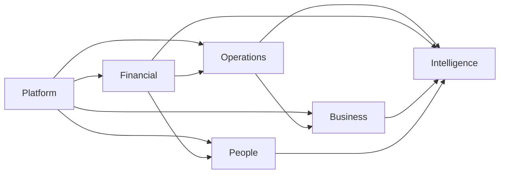

# Product Roadmap

## Conforms to Canon

- **P.4** — Six capability layers.
- **Chapter 1** — Product Philosophy (multi-everything, mobile parity, ≤ 1 business day to first transaction).
- **Chapter 3** — Architecture Principles (modular monolith; splits only via ADR).
- **Chapter 13** — Definition of Done (per-phase exit criteria must include Canon DoD).
- **All other chapters** — every layer's exit criteria conform to the corresponding Canon chapter.

The roadmap MUST NOT contradict the Canon; where a layer's ambition appears to require a Canon change, an ADR MUST be raised first.

---

## 1. Structure

The roadmap is organized **strictly by capability layers** (Canon P.4), not by calendar quarters. Calendar phasing is derived from layer readiness and appears in `01-master/success-metrics.md` and the sprint plan; this document fixes the *layer order and content*.

```text
Platform → Financial → Operations → Business → People → Intelligence
```

Later layers depend on earlier layers. Intra-layer modules ship incrementally per module PRDs.

## 2. Cross-layer dependency graph



Rules:

- Intelligence (dashboards, AI, forecasting) MUST NOT ship for a domain before that domain's authoritative data model is stable.
- Financial MUST NOT ship an accounting flow whose upstream operational document (invoice, GRN, payroll) is not yet in scope.
- Every layer inherits Platform capabilities (auth, tenancy, workflow, notifications, audit, permissions).

## 3. Layer 1 — Platform

### 3.1 Goals

Establish the foundation every other layer depends on: tenancy, identity, permissions, workflow, notifications, audit, documents, and the ERP Core Engines.

### 3.2 Deliverables

- Tenancy, Companies, Branches, Financial Years, Number Series, Configuration.
- Auth + MFA + SSO baseline.
- Permission Engine + RBAC.
- Workflow Engine + Approval Engine.
- Notification Engine (in-app + email; SMS/WhatsApp/push staged in).
- Audit Engine (immutable trail on all state changes).
- Document + Attachment Engines.
- Numbering Engine, Currency Engine, Localization Engine.
- Scheduler Engine, Automation Engine, Rules Engine.
- Import, Export, Search, Reporting, Dashboard Engines.
- Master Architecture, Database Architecture, Multi-Tenant model.
- Design System v1 and UX Standards.
- API v1 contract shape and gateway.

### 3.3 Dependencies

- Canon (must be approved).
- Business Blueprint (this pass) complete.

### 3.4 Exit criteria

- Canon Ch. 13 DoD satisfied for every Platform module.
- Multi-tenant, multi-company, multi-branch, multi-currency, multi-language, multi-financial-year usable in one demo tenant (Canon 1.R2).
- Audit trail exists for every state change in every shipped module (Canon Ch. 12).
- API v1 published for every capability shipped (Canon 2.R1).
- Performance targets in `performance.md` met at agreed load for platform surfaces.
- Time-to-first-transaction ≤ 1 business day with defaults (Canon 1.R6) validated end-to-end.

### 3.5 Risks

Summaries only; full entries in `01-master/risk-register.md`.

- Under-engineering the ERP Core Engines forces re-work in later layers.
- Multi-tenant isolation defects are catastrophic and non-negotiable.
- Design System instability propagates to every downstream module.

## 4. Layer 2 — Financial

### 4.1 Goals

Ship the financial platform: double-entry accounting, vouchers, tax (India + GCC), statements, banking, period close.

### 4.2 Deliverables

- Chart of Accounts + Voucher Engine + Posting Engine.
- Tax Engine (GST, TDS, TCS, VAT).
- Statements: Trial Balance, P&L, Balance Sheet, Cash Flow, Ledger, Day Book.
- GST returns (GSTR-1, GSTR-3B); VAT return for one GCC jurisdiction.
- Banking: manual + statement import + reconciliation.
- Period lock/unlock with audit.
- AR/AP aging, outstanding.
- Financial dashboards (persona-driven).

### 4.3 Dependencies

- Layer 1 Platform fully exited.
- Localization catalogs for India + first GCC jurisdiction present.

### 4.4 Exit criteria

- Every state-changing financial action posts via the Posting Engine (Canon Ch. 5).
- Statement drill-down reaches the originating voucher (Canon Ch. 12).
- GST filing round-trip verified against real GSTN sandbox.
- VAT filing artifact accepted by a chartered accountant review for the shipping GCC jurisdiction.
- Statutory-first behavior verified (Canon 1.R4).
- Performance and quality-attribute targets met for financial surfaces.

### 4.5 Risks

- Statutory rule changes mid-phase.
- Reconciliation edge cases against banking partners.
- Rounding / precision defects in tax computation.

## 5. Layer 3 — Operations

### 5.1 Goals

Ship inventory, sales, purchase, POS, and SME-scale manufacturing.

### 5.2 Deliverables

- Item master (HSN/SAC, UoM, batches, serials, warehouses, bins).
- Sales cycle (Quote → Order → Delivery → Invoice → Return).
- Purchase cycle (Requisition → RFQ → PO → GRN → Bill → Return).
- Inventory valuation (FIFO + Weighted Average) with locked policy per company.
- POS with offline queue.
- Manufacturing (BOM, production order, consumption, yield).
- Mobile: sales order entry, warehouse ops.
- Operations dashboards.

### 5.3 Dependencies

- Layers 1 + 2 exited.
- Tax Engine covering the shipping jurisdictions.

### 5.4 Exit criteria

- Order-to-cash and Procure-to-pay end-to-end in one tenant, mobile-parity for primary field tasks (Canon 1.R3).
- POS offline flow reconciles on reconnect (Canon 2.R4).
- Inventory valuation invariants hold under high-volume simulated load.
- Every operational voucher posts correctly via the Posting Engine.
- Performance targets met on the reference dataset.

### 5.5 Risks

- Inventory valuation invariants under concurrency.
- POS offline reconciliation edge cases (duplicate submission, clock skew).
- Manufacturing scope creep beyond SME depth.

## 6. Layer 4 — Business

### 6.1 Goals

Ship the customer-facing operational layer: CRM, Projects, AMC, Field Service.

### 6.2 Deliverables

- CRM: leads, opportunities, activities, pipeline, campaigns, mobile field-sales.
- Projects: tasks, timesheets, milestones, billing.
- AMC: contracts, schedules, renewals, entitlement.
- Field Service: tickets, dispatch, offline mobile visits, parts consumption, customer signature.
- Business dashboards.

### 6.3 Dependencies

- Layers 1–3 exited.
- Notification Engine channels (WhatsApp, SMS) live for the shipping jurisdictions.

### 6.4 Exit criteria

- Field service full journey (J6) works end-to-end offline on the reference low-bandwidth profile.
- CRM → Sales → Accounting → AMC round-trip works on one customer with no duplicated masters (Canon 1.5).
- Timesheet-to-invoice tested against a real professional-services scenario.

### 6.5 Risks

- Offline sync conflicts at field-technician scale.
- Mobile app store review cycles.
- Integration with communications providers per jurisdiction.

## 7. Layer 5 — People

### 7.1 Goals

Ship HRMS, Payroll, Assets, Fleet.

### 7.2 Deliverables

- HRMS: employee master, org, positions, attendance, leave, shifts.
- Payroll: salary structures, statutory (PF, ESI, PT, TDS for India; equivalents for GCC), payslips, bank files.
- Assets: register, depreciation, transfers, disposal.
- Fleet: vehicles, drivers, trips, expenses.
- Employee self-service mobile.

### 7.3 Dependencies

- Layers 1 + 2 exited (payroll posts to accounting).
- Statutory calendars and slabs for each shipping jurisdiction.

### 7.4 Exit criteria

- End-to-end hire-to-payslip in one company with statutory outputs validated.
- Attendance → payroll → posting audit trail complete.
- Depreciation runs produce the expected posting on schedule.

### 7.5 Risks

- Statutory slab / rate changes mid-phase.
- Attendance data ingestion from third-party devices.
- Cross-jurisdiction payroll complexity.

## 8. Layer 6 — Intelligence

### 8.1 Goals

Bring the AI fabric, analytics, and automation to production readiness across every prior layer.

### 8.2 Deliverables

- AI Copilot with tool-calling and RAG on tenant data (Canon Ch. 9).
- Domain AI surfaces (§ `09-ai/**`).
- Forecasting (cash, inventory, demand).
- Automations (rules, schedules, triggers) usable by tenants without code.
- Cross-module dashboards and executive summaries.
- Anomaly detection on financial and operational streams.
- Guardrails and provenance UI.

### 8.3 Dependencies

- Every prior layer stable (Intelligence consumes their data).
- AI Gateway operational; model provider swappable.

### 8.4 Exit criteria

- AI Copilot never performs a state change without human approval (Canon 9).
- Every AI action is fully audited (prompt, tool calls, citations).
- Forecasting error bounds documented per forecast type.
- Automation runs cannot bypass permissions or audit.
- Performance targets for AI surfaces met per `performance.md`.

### 8.5 Risks

- Model provider volatility (pricing, availability, policy).
- Hallucination in advisory outputs.
- Tenant-data leakage across contexts.
- Cost overruns from unbounded AI usage.

## 9. Milestones and phasing

Milestones are the *layer exits*, not calendar dates. Calendar phasing lives in sprint planning and derives from these exits. A layer MAY start work while the prior layer is being hardened, provided its Deliverables do not consume unfinished upstream capabilities.

## 10. Cross-cutting requirements (apply to every layer)

- Localization complete for every shipping locale before the layer exits (Canon 2.R5, Ch. 14).
- Mobile parity satisfied for the field-user primary tasks in that layer (Canon 1.R3).
- API v1 published for every capability shipped (Canon 2.R1).
- Audit trail present for every state change (Canon Ch. 12).
- Performance and quality-attribute targets met per `performance.md` and `quality-attributes.md`.
- Success-metric baselines instrumented before layer exit (`01-master/success-metrics.md`).

## 11. Change control

Roadmap changes are governed by `governance.md`. Any change that requires a Canon amendment MUST be raised as an ADR first (Canon P.3, A.2).

## 12. References

- Canon (`canon.md`)
- Master PRD (`01-master/prd.md`)
- Product Scope (`01-master/scope.md`)
- Success Metrics (`01-master/success-metrics.md`)
- Assumptions (`01-master/assumptions.md`)
- Risk Register (`01-master/risk-register.md`)
- Performance (`performance.md`)
- Quality Attributes (`quality-attributes.md`)
- Module Dependency Matrix (`module-dependency-matrix.md`)
