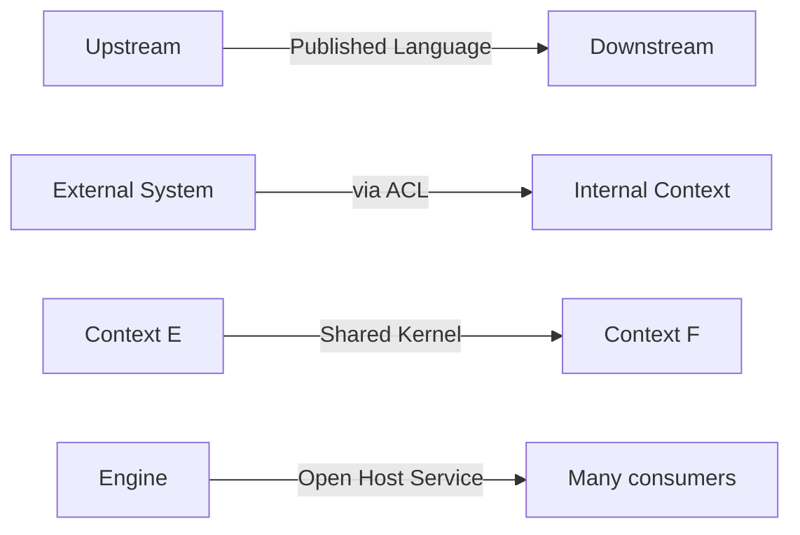
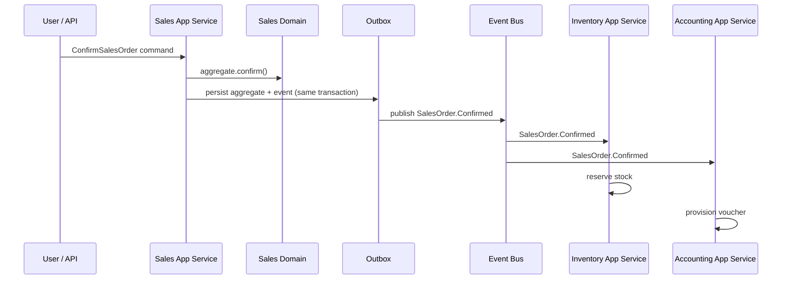

# Domain-Driven Design

## Conforms to Canon

- **P.3** Authority Hierarchy — this document ranks below the Canon and Master Architecture.
- **Chapter 1** Product Philosophy — one product identity, one data model.
- **Chapter 2** Product Principles — configuration-as-data, no per-tenant code branches.
- **Chapter 3** Architecture Principles — modular monolith, strict bounded contexts, event-driven cross-context writes, ERP Core Engines shared.
- **Chapter 5** Accounting — posting invariants inform aggregate design.
- **Chapter 6** Currency — value-object correctness for money.
- **Chapter 9** AI — AI participates as an actor with human-in-the-loop; AI actions traverse the same application service surfaces as human actors.
- **Chapter 12** Audit — every state change on an aggregate emits an audit event.
- **Chapter 13** Definition of Done — module DoD includes DDD conformance.

Where conflict arises, the Canon wins.

---

## 1. DDD Philosophy

BusinessOS is a domain-heavy product. Its long-term coherence depends on:

- One customer, one item, one employee, one voucher — same aggregate identity across every module.
- Language that matches how the business talks (a "voucher," a "GRN," a "payslip" — never "generic transaction record").
- Boundaries that reflect real ownership, so a change in accounting rules does not ripple through inventory code.

**DDD interlocks with the modular monolith** (Master Architecture AP-02, AP-03). Bounded contexts are the *seams* along which the monolith may later split — no more, no less. Cross-context references use identifiers only (Canon 3.R3); cross-context writes use events (Canon 3.R4).

DDD is a strategy for the write model. Read models MAY be organized by module or by report; the discipline documented here applies to the write side.

---

## 2. Bounded Context Strategy

### 2.1 Definition

A **bounded context** is a linguistic and behavioral boundary. Inside the boundary, one word has one meaning. Across boundaries, the same word MAY mean different things — that difference is stated in the context map, not hidden.

### 2.2 Sizing

A bounded context is sized to:

- **One team's cognitive load.** If two teams must jointly modify the domain layer of one context, the context is too big.
- **One coherent language.** If a word means two different things inside the context, the context has two contexts hiding inside it.
- **One rate of change.** If two halves of the context evolve at very different rates, they belong in separate contexts.

### 2.3 Ownership

Every bounded context has exactly one owning team. Ownership is recorded in the Domain Map. Multiple contexts MAY share a team; a context MUST NOT be split across teams.

### 2.4 Public surface

Each context exposes:

- **Commands** — imperative write intents.
- **Queries** — read intents against the context's authoritative model (or a read model it owns).
- **Domain events** — past-tense state changes it publishes.

Consumers of a context MUST use this surface, not the context's internals (Canon 3.R7). Direct database access across contexts is prohibited (Canon 3.R3).

---

## 3. Domain Evolution Rules

The domain map is not frozen. Splits, merges, ownership changes, and new integration patterns are expected. This section fixes **how** those changes happen.

### 3.1 When to split a bounded context

Split when any of the following holds:

- **Language divergence.** The same term has drifted to two meanings inside the context.
- **Aggregate contention.** Two aggregates in the context are almost never modified in the same transaction and their invariants do not overlap.
- **Divergent lifecycles.** Two capabilities inside the context release on very different schedules.
- **Divergent SLAs.** One capability needs different availability, performance, or resilience targets than another.
- **Team topology.** The context has grown past a single team's cognitive load.

The split MUST be captured as an ADR before code moves. The ADR MUST list which aggregates go to which new context, which events change name or shape, and the deprecation window for the old surface.

### 3.2 When to merge contexts

Merge when all of the following hold:

- **Perpetual cross-context transactions.** Two contexts are almost always modified together and the coordination cost outweighs the boundary benefit.
- **Identity overlap.** The aggregates are the same aggregate wearing two names.
- **One team owns both.** Ownership already unified informally.

Merges MUST also be ADR-gated. The ADR MUST specify how the merged context absorbs both ubiquitous languages (which term wins) and how existing events remain compatible during the deprecation window.

### 3.3 When to introduce a new Shared Kernel

Canon 3.R3 disallows shared entity classes across contexts. A Shared Kernel is therefore reserved for **cross-cutting value objects** with a single canonical definition:

- Money, Currency, Amount.
- Address, Phone, Email — insofar as their format is universal.
- Tax jurisdiction codes.
- Country and locale codes.
- Time zones, calendars.

A new Shared Kernel entry MUST:

- Be a value object with no identity.
- Be genuinely universal — not just used by two contexts.
- Be governed by a single owner (the Foundation domain by default).
- Be ADR-gated at introduction.

Ambition to share entity classes (e.g., "Customer" across CRM and Accounting) is a red flag; the correct answer is identifiers + events + local projections, not a Shared Kernel.

### 3.4 When to introduce an Anti-Corruption Layer

Introduce an Anti-Corruption Layer (ACL) when:

- Integrating with an external system whose model would corrupt ours (a statutory portal, a bank API, a marketplace API, a legacy system).
- Wrapping a deprecated internal context during a migration window.
- Bridging a partner plugin whose model does not match ours.

An ACL:

- Translates external terminology to the internal ubiquitous language.
- Absorbs external protocol volatility (rate limits, retries, schemas).
- Publishes internal events on behalf of the external system.

Every external integration MUST have an ACL; direct external calls from a domain layer are prohibited (Master Architecture §7.6).

### 3.5 How domain ownership changes

Ownership changes follow this path:

1. **Proposal.** Any team MAY propose an ownership change with a written rationale.
2. **ADR.** The change is ADR-gated. The ADR names the outgoing and incoming owners.
3. **Event and API compatibility obligations.** Published events and public APIs MUST NOT change their shape during handoff; the incoming owner assumes them as-is and deprecates via the standard deprecation policy.
4. **Deprecation windows.** For any surface the new owner intends to retire, a deprecation window of at least one roadmap layer applies unless the ADR explicitly justifies less.
5. **Recording.** The ownership change is reflected in `02-architecture/domain-map.md` in the same pass.

### 3.6 Change control

Every split, merge, Shared Kernel addition, and ownership change MUST be captured in an ADR before code moves. Post-hoc rationalization is prohibited.

---

## 4. Ubiquitous Language

### 4.1 Per-context glossaries

Each domain PRD (`04-domains/**`) owns its glossary. The glossary defines every noun and verb used inside the context. The top-level `glossary.md` indexes cross-context terms.

### 4.2 Reuse policy

A term MAY be reused across contexts if and only if it means the same thing. Otherwise, the contexts MUST use distinct terms (or the same term qualified by context — "Sales.Customer" vs "Accounting.Customer" in cross-context communication).

### 4.3 Deprecation

When a term is renamed:

- The old term MUST remain valid for at least one roadmap layer.
- Documentation MUST show both terms during the deprecation window.
- Events using the old term MUST be dual-published, or renamed only across a new event version (Canon 3.R8).

Glossary governance (rules for adding, deprecating, and cross-referencing terms) is a deferred document (`glossary-governance.md`, later pass).

---

## 5. Context Mapping

Context relationships are named. Every relationship in `02-architecture/domain-map.md` MUST use one of these labels.

### 5.1 Shared Kernel

Two contexts share a small set of value objects (Money, Currency, etc.). Governed by a single owner. Use sparingly (§3.3).

### 5.2 Anti-Corruption Layer (ACL)

A translation layer that isolates a context from an external model. Every external integration MUST use this pattern.

### 5.3 Open Host Service

A context publishes a stable, general-purpose interface for many consumers. Applies to Foundation (auth, tenants), the Notification Engine, the Permission Engine, and other engines that serve many callers.

### 5.4 Published Language

A specific event or command schema that is treated as a stable public contract. Versioned per Canon 3.R8. All cross-context events are Published Language unless explicitly private.

### 5.5 Separate Ways

Two contexts that intentionally do not integrate — each solves its concern independently. Rare in ERP; used only when integration cost exceeds value.

### 5.6 Customer / Supplier

One context depends on another and can influence its roadmap. The upstream (supplier) commits to a stable contract; the downstream (customer) commits to consuming that contract.

### 5.7 Conformist

The downstream context accepts the upstream model as-is because negotiating leverage is absent. Applied to some external integrations where an ACL translates without contest.

### 5.8 Diagram legend

---

## 6. Building Blocks

### 6.1 Aggregate

- The **consistency boundary**. All invariants of an aggregate hold at the end of every transaction.
- Referenced from outside only by its root's identifier.
- Modified only through its root.
- A transaction MUST touch at most one aggregate instance for state changes; multiple reads are allowed.

### 6.2 Entity

- Has an identity that persists across state changes.
- Lives inside an aggregate (as the root or a child).
- Identity is opaque; MUST NOT encode business meaning.

### 6.3 Value Object

- Defined by its attributes, not by identity.
- Immutable.
- Comparison by value.
- Preferred for domain modeling of concepts like Money, Address, DateRange, TaxCode.

### 6.4 Repository

- Reconstitutes and persists aggregates.
- One repository per aggregate root.
- No cross-aggregate queries in a repository (that is the read model's job).

### 6.5 Factory

- Encapsulates aggregate construction when construction has non-trivial invariants.
- Not required for simple aggregates.

### 6.6 Domain Service

- Encapsulates domain logic that does not belong to a single aggregate (e.g., double-entry posting spans multiple accounts).
- Stateless.
- Named by verb, not by noun.

### 6.7 Application Service

- The public surface of the context for external callers.
- Orchestrates: authorization → command validation → aggregate loading → domain call → persistence → event publication → audit.
- Contains no domain rules; delegates to the domain layer.

### 6.8 Policy

- A domain rule that is invoked reactively (often by an event).
- Named by intent: "OnPaymentReceived, close matching invoices."

### 6.9 Specification

- Encapsulates a predicate over an aggregate.
- Reusable across queries and validation.

---

## 7. Domain Events

### 7.1 Kinds

- **Domain events** — published inside a context, primarily consumed inside the same process.
- **Integration events** — published across context boundaries, treated as Published Language.

### 7.2 Naming

- Past tense: `SalesOrder.Confirmed`, `Voucher.Posted`, `Employee.Onboarded`.
- Aggregate first, then verb.
- Never imperative ("Confirm..." is a command, not an event).

### 7.3 Versioning

- Event schemas are versioned (Canon 3.R8).
- Additive changes MAY be made within a version.
- Breaking changes MUST introduce a new event name or version suffix.
- Consumers MUST tolerate unknown fields.

### 7.4 Contract stability

- Integration events are public contracts.
- Deprecation window of at least one roadmap layer for renames or removals.
- Deprecations are recorded in the Decision Register.

### 7.5 Ordering guarantees

- Within a single aggregate, events are ordered by publication time.
- Across aggregates, ordering is not guaranteed. Consumers MUST NOT rely on cross-aggregate ordering.
- Concrete delivery semantics are ADR-gated (Master Architecture §13 — "Event Bus implementation").

### 7.6 Cross-context write flow

---

## 8. Commands and Queries

### 8.1 Commands

- Imperative name: `ConfirmSalesOrder`, `PostVoucher`, `EnrollEmployee`.
- Carry an idempotency key.
- Carry an actor identity.
- Validated at the application service before touching the domain.

### 8.2 Queries

- Named by intent.
- Read from an authoritative store or a read model owned by the context.
- MUST NOT mutate state.

### 8.3 When CQRS is justified

Introduce a separated read model when at least one of:

- Read load significantly exceeds write load and the write model cannot serve reads within targets.
- Multiple presentation shapes are needed and mixing them into the write model complicates the domain.
- A dedicated store (search, analytics) is required for the read.

Never CQRS by default. Always ADR-gated per high-read domain (Master Architecture §13).

---

## 9. Consistency

### 9.1 Transaction boundaries

- One aggregate per state-changing transaction.
- The transaction also persists any outbox entries so events publish atomically with the state change.
- No distributed transactions across contexts.

### 9.2 Aggregate consistency

- All invariants of an aggregate hold at the end of every transaction.
- Aggregates load the state they need to enforce invariants — no more.

### 9.3 Eventual consistency

- Cross-context effects are eventually consistent.
- Consumers MUST tolerate the window between publication and processing.
- Users MAY be shown "in progress" state during the window; the audit record is authoritative.

### 9.4 Saga vs Process Manager

- **Saga** — long-running coordination expressed as a set of reactive policies; no central coordinator.
- **Process Manager** — a first-class aggregate that owns the state of a long-running process.

Both are legitimate. Choice is per-flow, ADR-gated where the flow spans many contexts or has compensating actions.

---

## 10. Module and Domain Ownership

- One bounded context ↔ one module (package) in the codebase.
- One module ↔ one owning team.
- A team MAY own multiple modules.
- A module MUST NOT be split across teams.
- Ownership is recorded in `02-architecture/domain-map.md` and reviewed at every roadmap layer exit.

---

## 11. Naming Conventions

- **Aggregates** — singular nouns: `SalesOrder`, `Voucher`, `Employee`.
- **Aggregate roots' identifiers** — `<Aggregate>Id`.
- **Value objects** — singular nouns: `Money`, `Address`, `TaxCode`.
- **Commands** — imperative verb + noun: `ConfirmSalesOrder`, `PostVoucher`.
- **Events** — past tense, aggregate first: `SalesOrder.Confirmed`, `Voucher.Posted`.
- **Repositories** — `<Aggregate>Repository`.
- **Domain services** — verb-first: `PostDoubleEntry`, `AllocateStock`.
- **Application services** — `<Aggregate>ApplicationService` or `<Aggregate>Commands` / `<Aggregate>Queries`.
- **Policies** — `On<Event>` or `When<Condition>`.
- **Specifications** — `<Predicate>Specification`.

Casing follows the platform's standard (`03-design/coding-standards.md`, later pass) — but names as reasoned above apply regardless of casing.

---

## 12. When NOT to Use DDD

DDD is overkill for:

- **Read-only reporting surfaces** — a report is a query and a projection, not a domain.
- **Integration adapters** — an ACL is not itself a domain; it translates.
- **Throwaway automations** — one-off migration scripts, seed jobs.
- **Purely presentational modules** — a design-system component library is not a domain.

For these, use the simplest approach that meets the requirement (Canon 2.2.1). Do not manufacture aggregates where none exist.

---

## 13. AI as a Domain Actor

AI is not a separate concern; it is an actor whose commands traverse the same application service surface as human actors, subject to the same authorization and audit (Canon 9). AI-initiated state changes require human approval, mediated by the Approval Engine. Aggregate design MUST NOT special-case AI actors.

---

## 14. Cross-References

- **Canon:** `canon.md`
- **Vision:** `00-vision/vision.md`
- **Master PRD:** `01-master/prd.md`
- **Roadmap:** `01-master/roadmap.md`
- **Business Model:** `01-master/business-model.md`
- **Product Scope:** `01-master/scope.md`
- **Success Metrics:** `01-master/success-metrics.md`
- **Assumptions Register:** `01-master/assumptions.md`
- **Risk Register:** `01-master/risk-register.md`
- **Master Architecture:** `02-architecture/master-architecture.md`
- **Domain Map:** `02-architecture/domain-map.md`
- **Glossary:** `glossary.md`
- **Governance:** `governance.md`
- **Decision Register:** `decision-register.md`
