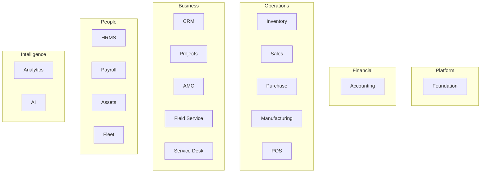
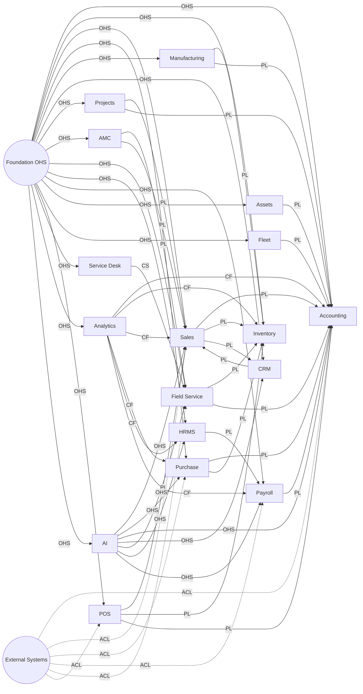
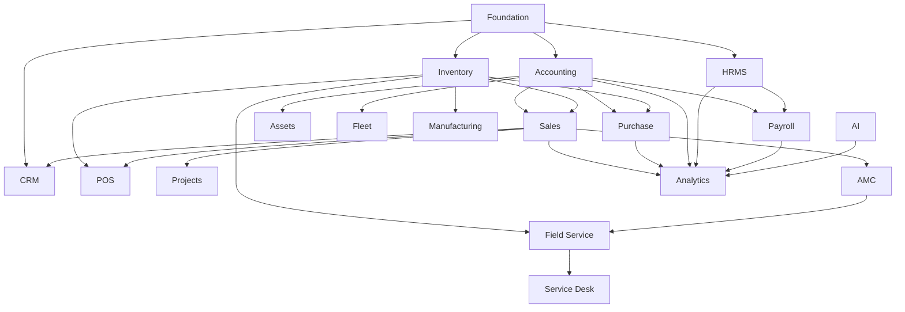
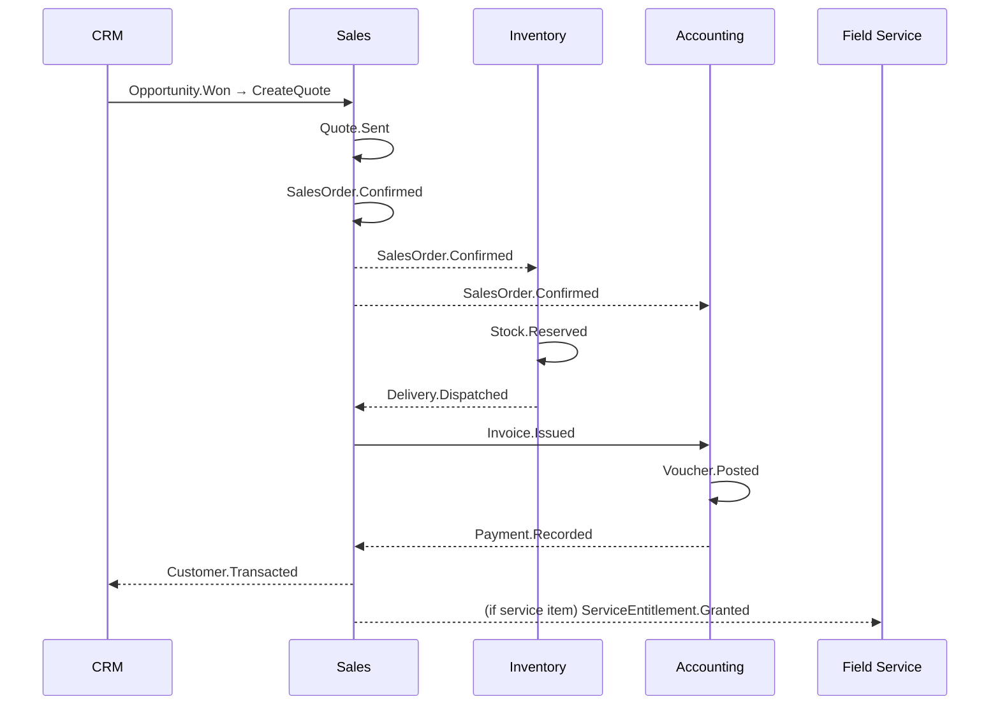
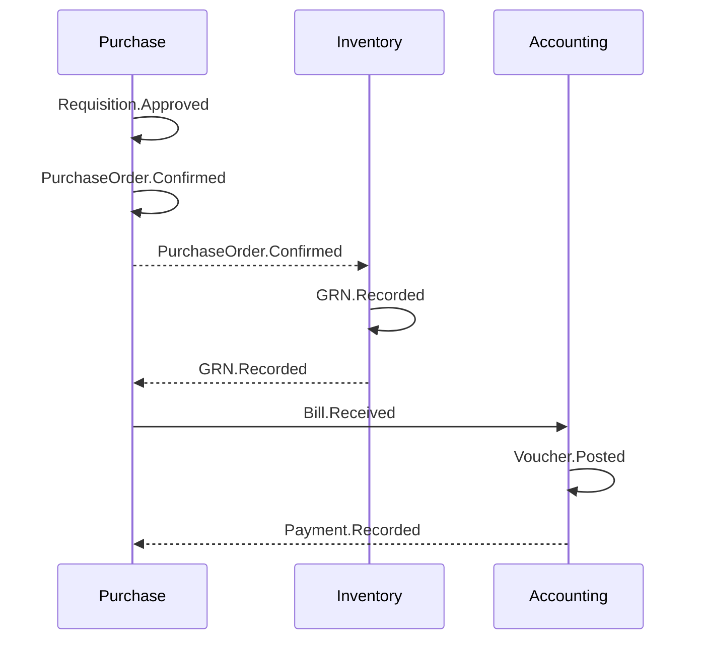
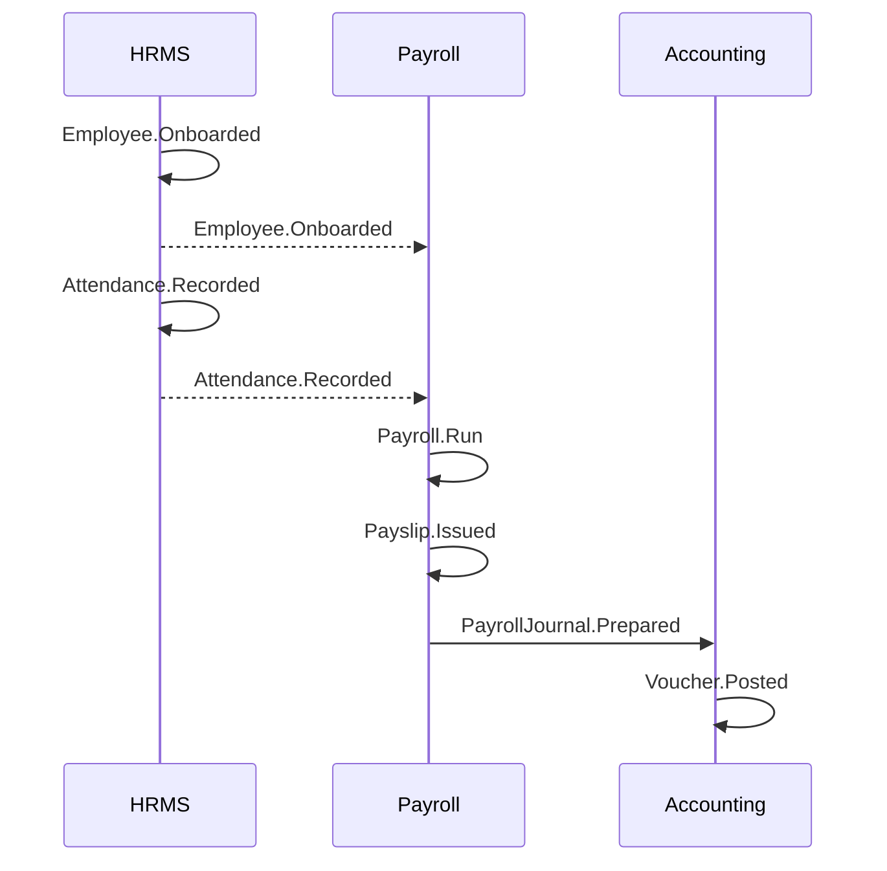

# Domain Map

## Conforms to Canon

- **P.4** — Six capability layers.
- **Chapter 1** — Product Philosophy (one product, one data model, one audit trail).
- **Chapter 3** — Architecture Principles (bounded contexts strict; identifiers across contexts; events for cross-context writes; ERP Core Engines shared).
- **Chapter 5** — Accounting (posting invariants inform the Accounting context boundary).
- **Chapter 9** — AI (AI is a bounded context with a service surface, not a diffuse cross-cutting feature).
- **Chapter 12** — Audit (every published event corresponds to a state change with an audit record).
- **Chapter 14** — Localization.

---

## 1. Purpose

This document names every bounded context, records what each owns, publishes, consumes, and depends on, and shows how they relate. It is normative for context boundaries. Table schemas, API paths, and wire formats are **not** in scope here.

## 2. Reading rules

- Aggregates are named only. Their internal shape lives in the domain PRD (`04-domains/**`).
- Events are named with the aggregate first and the verb in past tense (e.g., `SalesOrder.Confirmed`).
- External integrations are stated by **category** (banking, statutory portal, communications), never by vendor.
- Dependencies are stated at the domain level. Engine dependencies are stated separately in §22.

## 3. Ownership diagram — capability layers to domains

## 4. Context map — all domains

Labels: **PL** = Published Language, **CS** = Customer/Supplier, **ACL** = Anti-Corruption Layer, **OHS** = Open Host Service, **SK** = Shared Kernel, **CF** = Conformist.

## 5. Dependency DAG

## 6. Event flow — Order-to-cash

## 7. Event flow — Procure-to-pay

## 8. Event flow — Hire-to-payslip

---

## 9. Foundation

- **Purpose.** The platform's shared substrate: tenants, companies, branches, financial years, users, roles, permissions, workflow, approvals, numbering, notifications, audit, documents, attachments.
- **Responsibilities.** Provide Open Host Services consumed by every other context. Enforce tenancy at the persistence boundary. Enforce authorization on every command.
- **Owned aggregates.** Tenant, Company, Branch, FinancialYear, User, Role, PermissionGrant, Workflow, ApprovalRequest, NumberSeries, NotificationChannel, AuditRecord, Document, Attachment.
- **Published events.** `Tenant.Provisioned`, `Company.Created`, `User.Invited`, `User.Activated`, `Role.Assigned`, `PermissionGrant.Granted`, `Approval.Requested`, `Approval.Granted`, `Approval.Rejected`, `Notification.Dispatched`, `Document.Generated`.
- **Consumed events.** None as first-class dependencies; observes state-change events for audit indexing.
- **External integrations.** Identity providers (SSO), communications providers (email, SMS, WhatsApp, push).
- **Upstream dependencies.** None.
- **Downstream dependencies.** Every other domain.

## 10. Accounting

- **Purpose.** Double-entry general ledger, vouchers, tax computation, statements, statutory returns, period close.
- **Responsibilities.** Enforce posting invariants (Canon Ch. 5). Own the ledger. Produce statements and statutory returns.
- **Owned aggregates.** ChartOfAccounts, Voucher, Ledger, TaxComputation, Statement, Period, StatutoryReturn.
- **Published events.** `Voucher.Posted`, `Voucher.Reversed`, `Period.Locked`, `Period.Reopened`, `StatutoryReturn.Filed`.
- **Consumed events.** `SalesOrder.Confirmed`, `Invoice.Issued`, `Payment.Recorded`, `Bill.Received`, `GRN.Recorded`, `PayrollJournal.Prepared`, `AssetDepreciation.Run`, `FleetExpense.Recorded`, `POSShift.Closed`.
- **External integrations.** Statutory portals (GSTN, IRP, e-Way Bill, VAT authorities) via ACLs; banking portals via ACLs.
- **Upstream dependencies.** Foundation.
- **Downstream dependencies.** Analytics, AI.

## 11. Inventory

- **Purpose.** Items, batches, serials, warehouses, bins, transfers, valuation, stock levels.
- **Responsibilities.** Own the item catalog and stock state. Enforce valuation policy (FIFO/Weighted) per company. Reserve, receive, issue, and transfer stock.
- **Owned aggregates.** Item, UnitOfMeasure, Warehouse, Bin, Batch, Serial, StockMovement, Reservation, Valuation.
- **Published events.** `Item.Created`, `Stock.Reserved`, `Stock.Issued`, `Stock.Received`, `Stock.Transferred`, `GRN.Recorded`, `Delivery.Dispatched`, `StockValuation.Recomputed`.
- **Consumed events.** `SalesOrder.Confirmed`, `PurchaseOrder.Confirmed`, `ProductionOrder.Confirmed`, `POSShift.Closed`, `FieldVisit.Consumed`.
- **External integrations.** None directly; barcode/hardware via device adapters.
- **Upstream dependencies.** Foundation.
- **Downstream dependencies.** Sales, Purchase, Manufacturing, POS, Field Service, Accounting, Analytics.

## 12. Sales

- **Purpose.** Order-to-cash: quote, order, delivery, invoice, return.
- **Responsibilities.** Own the customer-facing sales aggregates. Coordinate reservation and invoicing.
- **Owned aggregates.** Quote, SalesOrder, Delivery, Invoice, SalesReturn, PriceList.
- **Published events.** `Quote.Sent`, `SalesOrder.Confirmed`, `Delivery.Dispatched`, `Invoice.Issued`, `SalesReturn.Approved`, `Payment.Recorded` (as receipt on invoice).
- **Consumed events.** `Opportunity.Won` (from CRM), `Stock.Reserved`, `Stock.Issued`, `Voucher.Posted`.
- **External integrations.** E-invoice portals via ACLs; payment gateways via ACLs.
- **Upstream dependencies.** Foundation, Accounting (for tax/posting), Inventory.
- **Downstream dependencies.** CRM, Projects, AMC, Field Service, Analytics.

## 13. Purchase

- **Purpose.** Procure-to-pay: requisition, RFQ, PO, GRN, bill, return.
- **Responsibilities.** Own vendor-facing purchase aggregates. Coordinate goods receipt with Inventory and posting with Accounting.
- **Owned aggregates.** Requisition, RFQ, PurchaseOrder, Bill, PurchaseReturn, Vendor.
- **Published events.** `Requisition.Approved`, `PurchaseOrder.Confirmed`, `Bill.Received`, `PurchaseReturn.Approved`, `Payment.Recorded` (as payment on bill).
- **Consumed events.** `GRN.Recorded`, `Voucher.Posted`.
- **External integrations.** Vendor portals via ACLs; e-invoice acknowledgements via ACLs.
- **Upstream dependencies.** Foundation, Accounting, Inventory.
- **Downstream dependencies.** Manufacturing (for material availability), Analytics.

## 14. Manufacturing

- **Purpose.** SME-scale production: BOM, production orders, consumption, yield.
- **Responsibilities.** Own the BOM and production aggregates. Trigger material consumption via Inventory; costing via Accounting.
- **Owned aggregates.** BillOfMaterials, Routing, ProductionOrder, MaterialConsumption, Yield.
- **Published events.** `BillOfMaterials.Approved`, `ProductionOrder.Confirmed`, `MaterialConsumption.Recorded`, `Yield.Recorded`, `ProductionOrder.Closed`.
- **Consumed events.** `Stock.Issued`, `Voucher.Posted`.
- **External integrations.** None core; MES/shop-floor is out of core scope (see `01-master/scope.md` §3).
- **Upstream dependencies.** Foundation, Inventory, Accounting.
- **Downstream dependencies.** Analytics.

## 15. CRM

- **Purpose.** Leads, opportunities, activities, pipeline, campaigns.
- **Responsibilities.** Own the pre-sales aggregate. Represent the customer relationship distinct from the accounting customer, sharing identity but with local projections.
- **Owned aggregates.** Lead, Opportunity, Activity, Campaign, PipelineStage.
- **Published events.** `Lead.Captured`, `Opportunity.Created`, `Opportunity.StageChanged`, `Opportunity.Won`, `Opportunity.Lost`, `Activity.Logged`, `Campaign.Launched`.
- **Consumed events.** `Invoice.Issued`, `Payment.Recorded`, `Customer.Transacted`, `FieldVisit.Completed`.
- **External integrations.** Communications (email, WhatsApp) via ACLs.
- **Upstream dependencies.** Foundation.
- **Downstream dependencies.** Sales, Analytics, AI.

## 16. Projects

- **Purpose.** Projects, tasks, timesheets, milestones, billing.
- **Responsibilities.** Own project aggregates; feed billable events to Sales.
- **Owned aggregates.** Project, Task, Milestone, TimesheetEntry, BillingSchedule.
- **Published events.** `Project.Started`, `Milestone.Reached`, `TimesheetEntry.Approved`, `BillingSchedule.DueTriggered`, `Project.Closed`.
- **Consumed events.** `Invoice.Issued`, `Voucher.Posted`.
- **External integrations.** None core.
- **Upstream dependencies.** Foundation, Sales, Accounting, HRMS (for resource identities).
- **Downstream dependencies.** Analytics.

## 17. AMC

- **Purpose.** Annual maintenance contracts: contracts, schedules, renewals, entitlement.
- **Responsibilities.** Own contract aggregates and entitlement. Trigger scheduled work in Field Service. Drive renewal invoicing in Sales.
- **Owned aggregates.** AMCContract, PreventiveMaintenanceSchedule, Entitlement, Renewal.
- **Published events.** `AMCContract.Signed`, `PreventiveMaintenanceSchedule.Due`, `Entitlement.Consumed`, `Renewal.Due`, `AMCContract.Expired`.
- **Consumed events.** `FieldVisit.Completed`, `Invoice.Issued`.
- **External integrations.** Communications for renewal reminders via ACLs.
- **Upstream dependencies.** Foundation, Sales.
- **Downstream dependencies.** Field Service, Analytics.

## 18. Field Service

- **Purpose.** Tickets, dispatch, offline mobile visits, parts consumption, signature.
- **Responsibilities.** Own ticket and visit aggregates. Serve as the offline-first module (Canon 2.R4). Feed Inventory consumption and Accounting billing.
- **Owned aggregates.** Ticket, Dispatch, FieldVisit, PartsConsumption, TechnicianAvailability.
- **Published events.** `Ticket.Opened`, `Ticket.Assigned`, `FieldVisit.Started`, `FieldVisit.Consumed`, `FieldVisit.Completed`, `PartsConsumption.Recorded`.
- **Consumed events.** `AMCContract.Signed`, `PreventiveMaintenanceSchedule.Due`, `Stock.Reserved`.
- **External integrations.** Mapping and routing providers via ACLs; communications (SMS/WhatsApp) via ACLs.
- **Upstream dependencies.** Foundation, Inventory, AMC.
- **Downstream dependencies.** Accounting, CRM, Service Desk, Analytics.

## 19. HRMS

- **Purpose.** Employee master, org structure, positions, attendance, leave, shifts.
- **Responsibilities.** Own the employee aggregate. Feed Payroll with attendance and leave data.
- **Owned aggregates.** Employee, Position, OrgUnit, Shift, LeaveRequest, AttendanceRecord.
- **Published events.** `Employee.Onboarded`, `Employee.Terminated`, `Position.Changed`, `Attendance.Recorded`, `LeaveRequest.Approved`.
- **Consumed events.** `Payslip.Issued` (for observability), `Approval.Granted`.
- **External integrations.** Biometric/attendance devices via ACLs; identity providers via ACLs.
- **Upstream dependencies.** Foundation.
- **Downstream dependencies.** Payroll, Projects, Field Service, Analytics.

## 20. Payroll

- **Purpose.** Salary structures, statutory computation, payslips, bank files.
- **Responsibilities.** Own payroll aggregates. Post payroll journals to Accounting.
- **Owned aggregates.** SalaryStructure, PayrollRun, Payslip, StatutoryDeduction, PayrollJournal.
- **Published events.** `PayrollRun.Started`, `Payslip.Issued`, `PayrollJournal.Prepared`, `StatutoryFiling.Prepared`.
- **Consumed events.** `Employee.Onboarded`, `Employee.Terminated`, `Attendance.Recorded`, `LeaveRequest.Approved`.
- **External integrations.** Statutory portals (PF/ESI/TDS for India; GCC equivalents) via ACLs; banking for salary disbursement via ACLs.
- **Upstream dependencies.** Foundation, HRMS, Accounting.
- **Downstream dependencies.** Analytics.

## 21. Assets

- **Purpose.** Fixed asset register, depreciation, transfers, disposal.
- **Responsibilities.** Own asset aggregates; run depreciation; post to Accounting.
- **Owned aggregates.** Asset, DepreciationSchedule, AssetTransfer, AssetDisposal.
- **Published events.** `Asset.Registered`, `AssetDepreciation.Run`, `Asset.Transferred`, `Asset.Disposed`.
- **Consumed events.** `Voucher.Posted`.
- **External integrations.** None core.
- **Upstream dependencies.** Foundation, Accounting.
- **Downstream dependencies.** Fleet (for asset-backed vehicles), Analytics.

## 22. Fleet

- **Purpose.** Vehicles, drivers, trips, expenses.
- **Responsibilities.** Own fleet aggregates; feed Accounting with expenses.
- **Owned aggregates.** Vehicle, Driver, Trip, FleetExpense.
- **Published events.** `Vehicle.Registered`, `Trip.Started`, `Trip.Completed`, `FleetExpense.Recorded`.
- **Consumed events.** `Voucher.Posted`.
- **External integrations.** Telematics providers via ACLs.
- **Upstream dependencies.** Foundation, Assets, Accounting.
- **Downstream dependencies.** Analytics.

## 23. POS

- **Purpose.** Fast checkout, offline resilience, mixed tender.
- **Responsibilities.** Own POS transaction aggregates; sync into Sales and Inventory on reconnect.
- **Owned aggregates.** POSTerminal, POSShift, POSTransaction.
- **Published events.** `POSShift.Opened`, `POSTransaction.Recorded`, `POSShift.Closed`.
- **Consumed events.** `Item.Created`, `PriceList.Updated`, `Stock.Reserved`.
- **External integrations.** Payment terminals, card networks, wallet providers via ACLs.
- **Upstream dependencies.** Foundation, Sales, Inventory, Accounting.
- **Downstream dependencies.** Analytics.

## 24. Service Desk

- **Purpose.** Non-field ticketing surface (internal helpdesk, customer support tickets not tied to a field visit).
- **Responsibilities.** Own ticket lifecycle for support cases; hand off to Field Service where dispatch is required.
- **Owned aggregates.** SupportTicket, SLAPolicy, KnowledgeArticle.
- **Published events.** `SupportTicket.Opened`, `SupportTicket.Resolved`, `SLAPolicy.Breached`.
- **Consumed events.** `AMCContract.Signed`, `FieldVisit.Completed`.
- **External integrations.** Communications providers via ACLs.
- **Upstream dependencies.** Foundation.
- **Downstream dependencies.** Field Service (Customer/Supplier: Service Desk supplies dispatch requests; Field Service is the supplier of resolutions on field cases), Analytics.

## 25. Analytics

- **Purpose.** Dashboards, reports, drilldowns, exports.
- **Responsibilities.** Consume events and read models across every domain; present aggregates for humans. Conformist to upstream contexts — never negotiates the shape of source domains.
- **Owned aggregates.** ReportDefinition, DashboardDefinition, ExportJob.
- **Published events.** `Report.Generated`, `Dashboard.Published`, `Export.Completed`.
- **Consumed events.** Effectively every published event in the platform.
- **External integrations.** BI or export destinations via ACLs where required.
- **Upstream dependencies.** Every domain.
- **Downstream dependencies.** AI (for context).

## 26. AI

- **Purpose.** Copilot, tool-calling, RAG, forecasting, module AI surfaces.
- **Responsibilities.** Provide an Open Host Service for AI capability to every domain. Route model requests through the AI Gateway. Enforce approval flows on state-changing AI actions (Canon 9). Provide provenance and citations.
- **Owned aggregates.** AIConversation, AIAction, AIToolCall, ForecastRun, GuardrailPolicy.
- **Published events.** `AIAction.Proposed`, `AIAction.Approved`, `AIAction.Rejected`, `AIAction.Executed`, `Forecast.Completed`.
- **Consumed events.** Cross-domain events relevant to the current AI task.
- **External integrations.** AI model providers via ACLs; embedding stores via ACLs; document parsers via ACLs.
- **Upstream dependencies.** Foundation. Reads projections from every domain.
- **Downstream dependencies.** Every domain that owns state changes AI proposes.

---

## 27. Engine dependencies (informative)

Domains depend on ERP Core Engines uniformly. Engines are shared services under `10-erp-core/**` (Pass 5). Every domain uses:

- Numbering Engine — document numbers.
- Workflow Engine + Approval Engine — state transitions and approvals.
- Notification Engine — user-facing notifications.
- Audit Engine — state-change records (Canon Ch. 12).
- Permission Engine — authorization.
- Currency Engine — money and FX.
- Tax Engine — tax computation (Financial, Operations, People).
- Localization Engine — strings, formats, calendars.
- Reporting Engine + Dashboard Engine — read surfaces.
- Import + Export Engines — bulk data.
- Document + Attachment Engines — files.
- Scheduler + Automation + Rules Engines — background jobs and configuration-driven behavior.

Modules MUST NOT re-implement these (Canon 3.R6, 2.R6).

---

## 28. References

- **Canon:** `canon.md`
- **Vision:** `00-vision/vision.md`
- **Master PRD:** `01-master/prd.md`
- **Roadmap:** `01-master/roadmap.md`
- **Business Model:** `01-master/business-model.md`
- **Product Scope:** `01-master/scope.md`
- **Success Metrics:** `01-master/success-metrics.md`
- **Assumptions Register:** `01-master/assumptions.md`
- **Risk Register:** `01-master/risk-register.md`
- **Master Architecture:** `02-architecture/master-architecture.md`
- **Domain-Driven Design:** `02-architecture/domain-driven-design.md`
- **Module Dependency Matrix:** `module-dependency-matrix.md`
- **Domain PRDs directory:** `04-domains/**` (Pass 7+)
- **ERP Core Engines directory:** `10-erp-core/**` (Pass 5)
