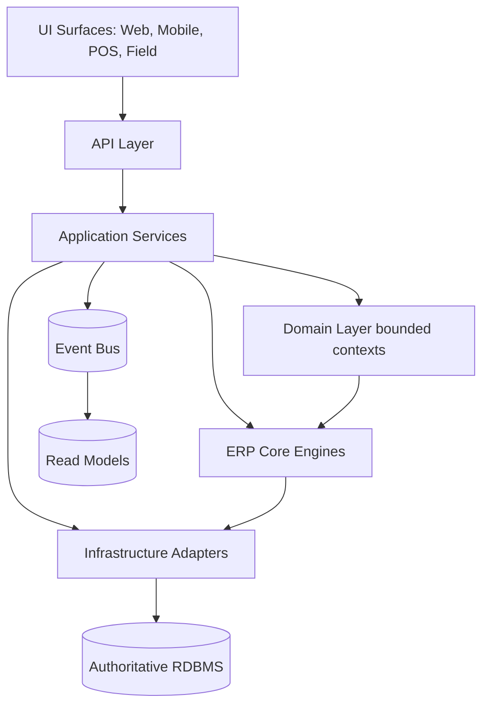
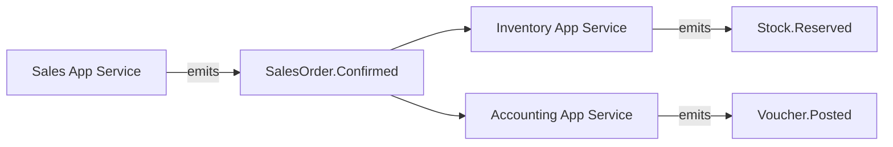
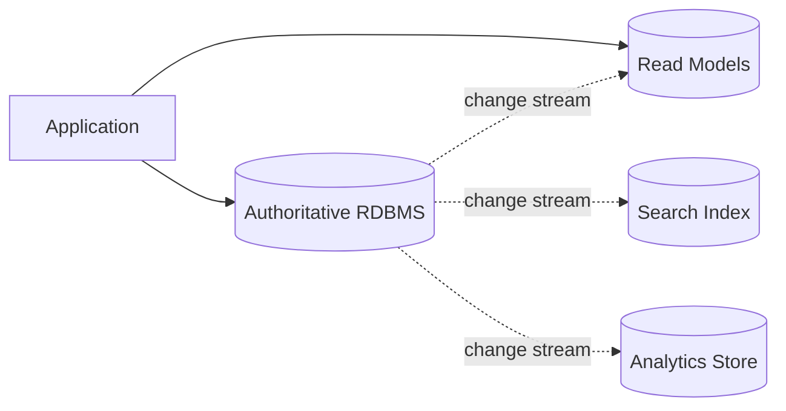
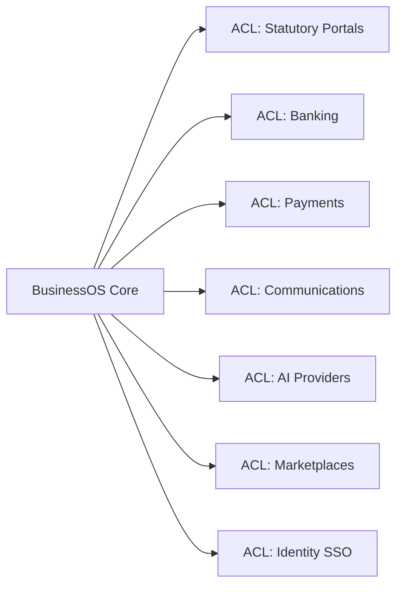

# Master Architecture

## Conforms to Canon

This document is subordinate to `canon.md` and to the Business Blueprint. It conforms specifically to:

- **P.3** Authority Hierarchy — Architecture ranks below the Canon and above Master PRD.
- **Chapter 1** Product Philosophy — one product, multi-everything, mobile parity, statutory-first.
- **Chapter 2** Product Principles — API-first, configuration-over-customization, mobile-first, offline-first, localizable-by-default.
- **Chapter 3** Architecture Principles — modular monolith, PostgreSQL as system of record, ERP Core Engines shared, bounded contexts, event-driven cross-context.
- **Chapter 5** Accounting (posting invariants inform the write model).
- **Chapter 6** Currency (currency correctness informs value objects).
- **Chapter 9** AI (AI fabric with mandatory human approval on state changes).
- **Chapter 12** Audit (immutable trail on all state changes).
- **Chapter 13** Definition of Done — architectural exit criteria per roadmap layer.
- **Chapter 14** Localization — locale-sourced strings, currencies, dates.

Where any statement here appears to conflict with the Canon, the Canon wins until an approved ADR amends it.

---

## 1. Executive Summary

BusinessOS ERP is a **cloud-native, multi-tenant, modular-monolith SaaS ERP** with a strict Domain-Driven Design core, an event-driven cross-context write model, a plugin-based extension surface, and an AI fabric threaded through every module with mandatory human approval on state changes.

The system is designed to run identically for a three-user tenant and a three-thousand-user tenant, in India first, GCC next, and the rest of the world thereafter. Its authoritative business data lives in a relational RDBMS (Canon 3.R1). Its extension surface is a plugin framework, not per-tenant code branches (Canon 2.R7). Its user experience is mobile-first with capability parity for field-user primary tasks (Canon 1.R3), and offline-first for field workflows (Canon 2.R4).

This document fixes the top of the architecture stack. Database, multi-tenancy, API, security, AI, deployment, DevOps, testing, and ERP engine architectures are authored in later passes and MUST conform to this one.

---

## 2. Architectural Vision

> **One coherent product built as a set of bounded contexts communicating via events, powered by shared ERP Core Engines, extended by plugins, co-piloted by AI, and localized by data — deployable as a single logical service today, splittable only when concrete evidence demands it (Canon 3.3).**

The architecture optimizes for four properties, in order:

1. **Consistency of the business fabric** — one customer, one item, one employee, one audit trail across every module.
2. **Long-term maintainability** — strict module boundaries, no per-tenant branches, shared engines for cross-cutting concerns.
3. **Time-to-value** — a tenant transacts on day one; features ship without cross-service coordination taxes.
4. **Evolvability** — service extraction, multi-region deployment, and provider swaps are possible without rewrites.

Speed of feature delivery, breadth of feature surface, and per-tenant configurability are downstream consequences of the four properties above, not primary objectives.

---

## 3. Architectural Drivers

### 3.1 Business Drivers

- Serve SMEs that intend to grow into mid-market and enterprise on the same product (Vision §4).
- Deliver time-to-first-transaction ≤ 1 business day (Canon 1.R6).
- Ship statutory-first behavior in every target jurisdiction (Canon 1.R4).
- Support a plugin marketplace as the sole extension surface (Canon 2.R7; Business Model §6).
- Sustain a subscription business with metered overage and no compliance paywall (Business Model §4).

### 3.2 Technical Drivers

- Modular Monolith as default; service extraction only via ADR (Canon 3.3).
- Bounded contexts communicate at write time via domain events (Canon 3.R4).
- PostgreSQL family as the system of record; denormalized read stores allowed but never authoritative (Canon 3.R1).
- Shared ERP Core Engines for cross-cutting responsibilities; no re-implementation per module (Canon 3.R6).
- Public capability exposed through an application layer only (Canon 3.R7).

### 3.3 Quality Attribute Drivers

Anchored to `quality-attributes.md` and `performance.md`. Priority order:

1. **Data integrity** — no lost, duplicated, or cross-tenant-leaked business data.
2. **Availability** — target uptime per `quality-attributes.md`.
3. **Performance** — targets per `performance.md`.
4. **Auditability** — every state change traceable (Canon Ch. 12).
5. **Scalability** — vertical first, horizontal thereafter, sharded only where justified.

### 3.4 Regulatory Drivers

- India: GST (GSTR-1, GSTR-3B), e-Invoice (IRP), e-Way Bill, TDS, TCS.
- GCC target jurisdictions: VAT return schemas, e-invoicing where mandated.
- Data residency options per target jurisdiction (Business Model §10; Risk R-011).
- Privacy rights (access, portability, erasure) supported at the platform layer (PRD §14).

---

## 4. Quality Attributes

Targets live in `performance.md` and `quality-attributes.md`. This section fixes the **architectural response** to each attribute.

### 4.1 Availability

Architectural response: stateless application tier behind a load balancer; database with automated failover; feature flags to shed load; graceful degradation of AI and reporting surfaces before core transactional surfaces.

### 4.2 Scalability

Architectural response: modular monolith horizontally scaled at the process level; per-tenant work partitioning at the queue layer; read replicas for reporting; CQRS-style read models only where justified by measured load.

### 4.3 Performance

Architectural response: server-authored read models for hot paths; per-tenant caches with strict scoping; pagination and cursor-based lists; asynchronous jobs for long operations; timeouts and circuit breakers on integrations.

### 4.4 Reliability

Architectural response: idempotent commands; at-least-once event delivery with deduplication at the consumer; retries with exponential backoff and jitter; poison-message quarantine.

### 4.5 Maintainability

Architectural response: Clean Architecture layering; bounded contexts; strict dependency direction (domain does not depend on infrastructure); shared engines for cross-cutting concerns; forbidden circular dependencies.

### 4.6 Extensibility

Architectural response: Plugin Framework with sandboxing and scoped permissions; versioned public APIs and events; deprecation windows; no per-tenant core patches (Canon 2.R7).

### 4.7 Observability

Architectural response: structured logs, request-scoped correlation IDs, metrics per SLO, tracing across boundary hops, audit stream as an independent observable channel (Canon Ch. 12).

### 4.8 Security

Architectural response: identity-per-request with claims propagated to every layer; RBAC on the Permission Engine (Canon 3.R6); encryption in transit and at rest; least-privilege between components; secret management outside code; input validation at the boundary. Detailed posture is authored in `security-architecture.md` (later pass).

### 4.9 Localization

Architectural response: no user-visible string in code (Canon 2.R5); locale-sourced dates, numbers, currencies; per-tenant defaults; RTL support in the design system.

### 4.10 Offline Capability

Architectural response: field-user mobile surfaces persist state-changing intents locally; server-authoritative reconciliation with deterministic conflict rules; server MUST accept out-of-order arrivals within a bounded window (Canon 2.R4).

### 4.11 Disaster Recovery

Architectural response: automated backups, cross-region replicas, quarterly restore drills; RPO/RTO per `quality-attributes.md`; runbooks for regional failover.

---

## 5. Constraints

### 5.1 Business Constraints

- No compliance feature gated by edition in target jurisdictions (Canon 1.R4).
- No third-party paid marketplace required to deliver core operational capability (Canon 1.R5).
- No per-tenant code branches (Canon 2.R7).
- Time-to-first-transaction ≤ 1 business day (Canon 1.R6).

### 5.2 Technology Constraints

- PostgreSQL family as system of record (Canon 3.R1).
- Modular monolith as default (Canon 3.3).
- Shared ERP Core Engines for cross-cutting concerns (Canon 3.R6).
- Public capability exposed via an application layer only (Canon 3.R7).
- Every capability has a versioned API at `/v1` before ship (Canon 2.R1).

### 5.3 Compliance Constraints

- Statutory features first-class in target jurisdictions.
- Data residency options where market or contract demands.
- Immutable audit trail on every state change (Canon Ch. 12).
- Privacy rights supported end-to-end at the platform layer.

### 5.4 Performance Constraints

- Targets per `performance.md`; architecture must not preclude them.
- Report generation MUST be asynchronous beyond a defined size ceiling (definition in Reporting Engine spec, later pass).
- AI actions MUST NOT block a state-changing user action for approval; approval flow is asynchronous where the user context allows it.

---

## 6. Architectural Style

Each style is chosen deliberately; a summary of **why** follows the choice.

### 6.1 Cloud Native

Managed platform primitives (compute, storage, queue, cache, observability). Immutable infrastructure. Horizontal scaling by default.

**Why chosen:** aligns with the Business Model's cloud-first assumption (A-005); minimizes operational surface; enables regional deployment without bespoke infrastructure.

### 6.2 Modular Monolith

Single deployable, internally partitioned into strict bounded contexts (Canon 3.R2). Cross-context references by ID (Canon 3.R3). Cross-context writes by domain event (Canon 3.R4).

**Why chosen:** Canon 3.3. Delivers most of the benefits of microservices (module boundaries, testability, team topology) without the distributed-system tax until scale demands it. Splitting is possible later per ADR.

### 6.3 Event-Driven

Domain events published on state changes; integration events at bounded-context boundaries; at-least-once delivery; versioned event schemas (Canon 3.R8).

**Why chosen:** decouples write-time cross-context reactions; enables read-model materialization; enables plugin reactions without coupling core code.

### 6.4 API-First

Every user-facing capability has a matching versioned API endpoint before it is considered shipped (Canon 2.R1).

**Why chosen:** enables mobile parity (Canon 1.R3), plugin authoring, integrations, and automation without retrofits.

### 6.5 Domain-Driven Design

Bounded contexts, aggregates, ubiquitous language per domain, published events, ACLs at boundaries with external systems. Detailed in `domain-driven-design.md`.

**Why chosen:** ERP is a domain-heavy product. Anchoring language and boundaries in the domain prevents the incoherent-suite failure mode (Vision §2).

### 6.6 Clean Architecture

Domain at the center; application services around it; infrastructure at the edge. Dependencies point inward only.

**Why chosen:** the write model must remain testable and independent of frameworks and vendors; keeps ADR-driven infrastructure swaps affordable.

### 6.7 CQRS (where justified)

Separate read models for high-read domains (reports, dashboards, lists). Not the default.

**Why chosen:** deliberate; premature CQRS is a common source of drift. Introduce only against measured read load.

### 6.8 Plugin Architecture

First-party and third-party extensions run inside a sandbox with scoped permissions via the Permission Engine (Canon 2.R7).

**Why chosen:** replaces per-tenant customization; enables partner ecosystem; keeps core patch-free.

---

## 7. Architecture Views

### 7.1 Logical View

Six capability layers (Canon P.4), each containing bounded contexts. Every context sits atop the shared ERP Core Engines and the Platform layer.

### 7.2 Application View

Application services per bounded context expose commands and queries. Cross-context writes go via events, never by cross-context method calls into another domain.

### 7.3 Domain View

Each bounded context owns its aggregates. Cross-context relationships are represented by identifiers, not shared entity classes (Canon 3.R3). Aggregate rules and building blocks: see `domain-driven-design.md`.

### 7.4 Data View (high level only)

Authoritative data lives in a relational RDBMS. Read models MAY be materialized in the same RDBMS or in dedicated stores. Search MAY be served from a dedicated engine. Analytics MAY be served from an OLAP store. Detailed data architecture is authored in `database-architecture.md` (Pass 4B).

### 7.5 Infrastructure View (high level only)

- Compute: stateless application tier.
- Storage: primary RDBMS; object storage for attachments.
- Queue: asynchronous work and integration outbox.
- Cache: per-tenant scoped where used.
- Event bus: at-least-once delivery.
- Observability: logs, metrics, traces, audit stream.
- Secret management: outside application code.

Detailed infrastructure is authored in `deployment-architecture.md` (Pass 4D).

### 7.6 Integration View

External integrations run behind Anti-Corruption Layers. Categories: statutory portals, banking, payments, communications (email/SMS/WhatsApp/push), AI providers, marketplaces, files, identity/SSO. Detail: `06-integrations/**`.

### 7.7 Security View (conceptual only)

Identity flows from the edge inward as claims. Every command carries an actor identity. Every authorization decision consults the Permission Engine. Every state change writes an audit event. Data is encrypted in transit and at rest. Detailed posture: `security-architecture.md` (Pass 4C).

### 7.8 Deployment View (conceptual only)

Single logical service deployable to a managed compute platform. Regional deployment as the market or contract requires. Detailed topology: `deployment-architecture.md` (Pass 4D).

---

## 8. Cross-Cutting Concerns

Each concern is owned by a specific ERP Core Engine (Canon 3.R6). Engine specifications are authored in `10-erp-core/**` (Pass 5).

| Concern | Purpose | Owner (Engine) |
|---|---|---|
| Logging | Structured, correlation-scoped, PII-safe. | Observability capability (spec: Pass 4D). |
| Auditing | Immutable trail of every state change (Canon Ch. 12). | Audit Engine. |
| Caching | Per-tenant scoped invalidation; hot-path acceleration. | Platform infrastructure (ADR pending, §13). |
| Notifications | In-app, email, SMS, WhatsApp, push. | Notification Engine. |
| Workflow | State machines, approvals, escalations. | Workflow Engine + Approval Engine. |
| Localization | Locale-sourced strings, dates, numbers, currencies. | Localization Engine. |
| Configuration | Tenant-owned data for numbering, rules, workflows. | Configuration capability (Foundation domain). |
| Feature Flags | Progressive rollout, kill switches, plan-gating hooks. | Platform (ADR pending). |
| Scheduling | Periodic jobs, cron, deferred work. | Scheduler Engine. |
| File Storage | Attachments, exports, generated documents. | Attachment Engine + Document Engine. |
| Search | Full-text, faceted, per-tenant scoped. | Search Engine. |
| AI | Copilot, tool-calling, RAG, forecasting, guardrails. | AI Gateway + module AI surfaces (Canon Ch. 9). |

Modules MUST NOT re-implement any concern above (Canon 3.R6, 2.R6).

---

## 9. Architecture Principles Catalog

Every principle uses the same template. **Related ADR** is a placeholder until an ADR is authored in Pass 6.

### AP-01 — PostgreSQL family as system of record

- **Principle.** All authoritative business data lives in a PostgreSQL-family RDBMS.
- **Motivation.** Transactional guarantees, mature ecosystem, strong operator familiarity, statement-grade reporting on the same store.
- **Implementation Direction.** All commands ultimately land in the authoritative store; read models and search indices are derived and never authoritative.
- **Trade-offs.** Some workloads (large-scale time-series, high-throughput search) require satellite stores; complexity of change data capture.
- **Examples.** Voucher posting writes to the authoritative store; search index is a downstream projection.
- **Related Canon Chapters.** 3 (3.R1).
- **Related ADR.** TBD (Pass 6).

### AP-02 — Modular monolith by default

- **Principle.** A single deployable containing strictly-bounded modules; service extraction only via ADR meeting Canon 3.3.
- **Motivation.** Retain module boundaries and team autonomy without the distributed-system tax.
- **Implementation Direction.** Every module is a package with a public application-layer surface and private domain internals; import discipline enforced.
- **Trade-offs.** Vertical scaling ceiling; noisy-neighbor risk; larger deploy blast radius.
- **Examples.** Sales and Inventory ship in the same process; they communicate via events, not method calls.
- **Related Canon Chapters.** 3 (3.3, 3.R2, 3.R5).
- **Related ADR.** TBD.

### AP-03 — Strict bounded contexts

- **Principle.** Every domain is a bounded context; cross-context references are by identifier only.
- **Motivation.** Prevents the "everything reaches everything" failure that erodes ERP maintainability.
- **Implementation Direction.** Contexts expose commands, queries, and events; no direct database access across contexts.
- **Trade-offs.** More boilerplate; some cross-context queries require read-model design.
- **Examples.** Accounting does not import the Customer aggregate; it consumes a `Customer.Created` event and stores its own reference.
- **Related Canon Chapters.** 3 (3.R2, 3.R3).
- **Related ADR.** TBD.

### AP-04 — Event-driven cross-context writes

- **Principle.** Cross-context write-time coupling MUST use domain events.
- **Motivation.** Loose coupling, plugin extensibility, replayability, observability.
- **Implementation Direction.** Transactional outbox for reliable publication; consumer-side deduplication; versioned schemas.
- **Trade-offs.** Eventual consistency; event evolution discipline required.
- **Examples.** `SalesOrder.Confirmed` triggers inventory reservation, accounting provision, and CRM update.
- **Related Canon Chapters.** 3 (3.R4, 3.R8).
- **Related ADR.** TBD.

### AP-05 — Configuration-as-data

- **Principle.** Business variability MUST be expressed as tenant-owned data, not code branches.
- **Motivation.** Prevents per-tenant code fossils; enables safe partner extensions.
- **Implementation Direction.** Configuration surfaces per Canon topic (numbering, workflows, approvals, tax rates, statement formats); each backed by a domain aggregate or configuration store.
- **Trade-offs.** More runtime resolution; more validation code.
- **Examples.** Approval matrices are Workflow Engine records; number series are Numbering Engine records; tax rates are Tax Engine records.
- **Related Canon Chapters.** 2 (2.R2, 2.R7).
- **Related ADR.** TBD.

### AP-06 — API-first

- **Principle.** Every user-facing capability has a matching versioned API at `/v1` before ship.
- **Motivation.** Mobile parity, integrations, plugins, automation.
- **Implementation Direction.** API contracts are authored alongside the domain; the UI consumes the API, not internals.
- **Trade-offs.** Contract discipline slows early prototyping; versioning obligations.
- **Examples.** Every screen's actions are expressible via the corresponding API surface.
- **Related Canon Chapters.** 2 (2.R1).
- **Related ADR.** TBD.

### AP-07 — Mobile-first

- **Principle.** Layouts assume small screens and enhance upward; field-user primary tasks meet capability parity on mobile.
- **Motivation.** Field roles are a large share of tenant usage; parity avoids second-class mobile UX.
- **Implementation Direction.** Design System v1 is mobile-first; interaction patterns validated on the reference device profile.
- **Trade-offs.** More design effort at the small-screen tier.
- **Examples.** POS, warehouse issue/receipt, field visits all run at parity on mobile.
- **Related Canon Chapters.** 1 (1.R3), 2 (2.2.5).
- **Related ADR.** TBD.

### AP-08 — Offline-first for field workflows

- **Principle.** Field-user state-changing actions persist offline and reconcile on reconnect.
- **Motivation.** Target markets have intermittent connectivity in field scenarios.
- **Implementation Direction.** Local durable queue on the mobile client; server-authoritative reconciliation; deterministic conflict rules per aggregate.
- **Trade-offs.** Conflict handling complexity; extra client storage.
- **Examples.** A technician completes an offline visit; the office sees it on reconnect.
- **Related Canon Chapters.** 2 (2.R4).
- **Related ADR.** TBD.

### AP-09 — AI-first with human-in-the-loop

- **Principle.** Every module has an AI surface designed with it; AI state changes require human approval.
- **Motivation.** AI as a co-worker with clear guardrails and provenance.
- **Implementation Direction.** AI Gateway abstracts providers; module AI surfaces are first-class in each domain; approval flows integrate with the Approval Engine.
- **Trade-offs.** Latency and cost of AI calls; guardrail engineering.
- **Examples.** AI drafts a purchase order; human approves before posting.
- **Related Canon Chapters.** 9.
- **Related ADR.** TBD.

### AP-10 — Localization-first

- **Principle.** No user-visible string, currency, or date format is hard-coded to a locale.
- **Motivation.** India, GCC, and global markets require locale-correct presentation and rules.
- **Implementation Direction.** Localization Engine sources every string, format, and calendar; per-tenant defaults; RTL support baseline.
- **Trade-offs.** Additional discipline in UI code; catalog maintenance.
- **Examples.** Amount formatting differs for INR vs AED; dates present in the tenant's calendar.
- **Related Canon Chapters.** 2 (2.R5), 14.
- **Related ADR.** TBD.

### AP-11 — Multi-tenancy at the data-model layer

- **Principle.** Tenancy is a property of the data model, not the deployment.
- **Motivation.** Same code path for a three-user and a three-thousand-user tenant.
- **Implementation Direction.** Tenant scoping enforced at the persistence boundary; every read and write carries a tenant identifier.
- **Trade-offs.** Row-level filtering and index design must consider tenancy always.
- **Examples.** A shared table with strong tenant-scoping vs. per-tenant schemas — decision deferred to `multi-tenant-architecture.md` (Pass 4B).
- **Related Canon Chapters.** 1 (1.R2), 3 (3.R6).
- **Related ADR.** TBD.

### AP-12 — Plugin extension over core patches

- **Principle.** Extension goes through the Plugin Framework; per-tenant patches to core code are prohibited.
- **Motivation.** Marketplace strategy; maintainability; safe evolution.
- **Implementation Direction.** Sandboxed plugin runtime; scoped permissions; versioned public surfaces.
- **Trade-offs.** Framework engineering cost; some early customer requests must be redirected to the framework.
- **Examples.** A tenant-specific field on Customer is a plugin, not a fork.
- **Related Canon Chapters.** 2 (2.R7).
- **Related ADR.** TBD.

### AP-13 — Shared ERP Core Engines

- **Principle.** Cross-cutting responsibilities live in the ERP Core Engines; modules MUST NOT re-implement them.
- **Motivation.** Consistency of behavior across the product; single point of change.
- **Implementation Direction.** Voucher, Posting, Workflow, Approval, Numbering, Notification, Document, Audit, Permission, Currency, Tax, Localization, Search, Reporting, Dashboard, Import, Export, Attachment, Scheduler, Automation, Rules.
- **Trade-offs.** Engines become critical paths; their evolution must be careful.
- **Examples.** Every voucher posts through the Posting Engine; no module writes its own ledger.
- **Related Canon Chapters.** 3 (3.R6), 2 (2.R6).
- **Related ADR.** TBD.

### AP-14 — Idempotent side effects

- **Principle.** Commands and event handlers are idempotent; retried delivery MUST NOT double-charge, double-post, or duplicate outbound integration calls.
- **Motivation.** At-least-once delivery is a fact of distributed messaging; correctness cannot depend on exactly-once.
- **Implementation Direction.** Command idempotency keys; consumer deduplication tables; outbox pattern for outbound integrations.
- **Trade-offs.** Extra state to track dedup keys; care in aggregate reconstitution.
- **Examples.** A retried `Payment.Recorded` event does not double-post to the ledger.
- **Related Canon Chapters.** 3 (3.R4), 5 (posting invariants).
- **Related ADR.** TBD.

### AP-15 — Audit everywhere

- **Principle.** Every state change writes an audit event with actor, correlation id, before, after, and reason where applicable.
- **Motivation.** Auditor-grade traceability; forensic replay; compliance.
- **Implementation Direction.** Audit Engine is called from application services on every state-change path; audit stream is an independent observable channel.
- **Trade-offs.** Storage cost; care to avoid PII leakage into audit records.
- **Examples.** Voucher edits, permission grants, workflow transitions, plugin installs all emit audit records.
- **Related Canon Chapters.** 12.
- **Related ADR.** TBD.

### AP-16 — Least-privilege by default

- **Principle.** Every component operates with the minimum permissions required.
- **Motivation.** Reduce blast radius of any single compromise.
- **Implementation Direction.** Scoped credentials for infrastructure roles; scoped permissions for plugins; RBAC for user actions; MFA available and enforceable.
- **Trade-offs.** Operational friction on onboarding; more granular access control to design.
- **Examples.** A plugin that reads Sales cannot write Accounting.
- **Related Canon Chapters.** 3 (3.R6 via Permission Engine).
- **Related ADR.** TBD.

---

## 10. Technology Overview

> *Technology capabilities and architectural roles are described. Specific frameworks, runtime versions, vendors, and implementation choices are intentionally deferred to ADRs and implementation documentation.*

At the capability level, BusinessOS assumes the following roles will be filled:

- A relational RDBMS with strong transactional guarantees, as the system of record.
- An asynchronous work queue with at-least-once delivery for background jobs and integration outbox.
- An event bus for domain and integration events (may be co-located with the queue or dedicated; decision deferred, §13).
- A per-tenant scoped cache for hot-path acceleration.
- An object store for attachments, exports, and generated documents.
- A search capability for full-text and faceted queries.
- An observability capability for structured logs, metrics, traces, and audit stream.
- A secret management capability outside application code.
- An AI gateway abstracting one or more model providers.
- A CDN and edge tier for static assets and public reads.

Where a role is filled by a specific technology, that choice is captured in an ADR, not here.

---

## 11. Risks

Risks are recorded in the Risk Register (`01-master/risk-register.md`). This section indexes the architecture-relevant IDs:

- **R-001** Multi-tenant data isolation defect.
- **R-003** Modular monolith scaling ceiling.
- **R-004** Inventory valuation invariants under concurrency.
- **R-005** Offline sync divergence.
- **R-006** Backup / restore RPO/RTO under regional outage.
- **R-007** Cloud region unavailability for residency.
- **R-040** Model provider disruption.
- **R-042** Tenant data leakage across AI contexts.
- **R-052** Plugin surface-area drift makes core changes back-incompatible.
- **R-071** Supply-chain compromise via dependency or plugin.

The Architecture Council reviews these on the cadence declared in the Risk Register.

---

## 12. Future Evolution

The architecture is designed to evolve without rewrites.

### 12.1 Service extraction triggers

Per Canon 3.3, a service split requires an approved ADR demonstrating concrete operational or scalability benefits. Candidate triggers:

- Sustained CPU or memory pressure on a specific bounded context beyond horizontal-scale headroom.
- Blast-radius considerations where a specific context's incidents disproportionately affect unrelated capabilities.
- Deployment-independence requirements from a specific team topology.
- Regulatory or contractual isolation that a single deployment cannot satisfy.

### 12.2 Multi-region evolution

Initial deployment is single-region per tenant. Multi-region evolves through: active-passive with regional failover → active-active with residency-aware routing. The specific strategy is ADR-gated (§13).

### 12.3 On-prem readiness

On-prem is not a Phase-1 requirement (Assumption A-005). The architecture MUST NOT preclude it: dependencies on managed platform primitives SHOULD be substitutable. When on-prem becomes required, an ADR will capture the packaging strategy.

---

## 13. Architectural Decisions Pending

This section lists architectural topics that intentionally remain unresolved and MUST be addressed through future ADRs. Every entry declares topic, why deferred, rough decision window (roadmap layer), and owner.

| Topic | Why deferred | Decision window | Owner |
|---|---|---|---|
| **Event Bus implementation** — in-process vs external broker; delivery semantics; ordering guarantees per topic. | Load characteristics and cross-team topology unclear until Platform layer is instrumented. | End of Platform layer. | Architecture Council. |
| **Search architecture** — embedded engine vs dedicated search cluster; per-tenant index vs shared index with tenant filter; reindex strategy. | Requires representative dataset and query mix; scale-testing target-market tenants first. | End of Operations layer. | Search Engine owner. |
| **Cache strategy** — layers, tenant scoping, invalidation, coherence with change streams. | Hot paths not yet identified with production telemetry. | Mid Financial layer. | Platform Engineering. |
| **File / object storage** — residency, lifecycle policies, signed access patterns, virus scanning. | Residency footprint depends on first market entries. | Mid Platform layer. | Attachment Engine owner. |
| **AI provider abstraction** — single vs multi-provider gateway; routing policy; fallback; observability of prompts and completions. | Provider landscape and unit economics volatile. | Start of Intelligence layer. | AI Platform. |
| **Multi-region deployment** — active-passive vs active-active; residency-aware routing; failover topology. | Depends on customer contractual demand and target-market residency rules. | Post-Financial layer, when residency contracts require. | Platform Council. |
| **CQRS materialization strategy per high-read domain** — where read models live, how they stay current, how consumers query them. | Requires measured read load, not speculation. | Per domain, at Layer exit. | Domain owner + Architecture Council. |
| **Analytics store** — same OLTP with reporting mode vs separate OLAP; ingestion pipeline. | Depends on report generation SLOs at scale (`performance.md`). | Start of Intelligence layer. | Reporting + Analytics owner. |
| **Metering and entitlement subsystem placement** — internal service, ERP Core Engine, or external billing platform. | Business Model §12 flags this as a downstream decision. | End of Platform layer. | Business Model owner + Architecture Council. |
| **Plugin runtime sandboxing model** — isolation boundary, resource limits, permission enforcement mechanism. | Requires prototype against the Plugin Framework. | Mid Business layer. | Architecture Council. |

Each entry becomes an ADR in Pass 6 or later. Until then, downstream documents MUST NOT presume a specific answer.

---

## 14. References

- **Canon:** `canon.md`
- **Vision:** `00-vision/vision.md`
- **Master PRD:** `01-master/prd.md`
- **Roadmap:** `01-master/roadmap.md`
- **Business Model:** `01-master/business-model.md`
- **Product Scope:** `01-master/scope.md`
- **Success Metrics:** `01-master/success-metrics.md`
- **Assumptions Register:** `01-master/assumptions.md`
- **Risk Register:** `01-master/risk-register.md`
- **Performance:** `performance.md`
- **Quality Attributes:** `quality-attributes.md`
- **Domain-Driven Design:** `02-architecture/domain-driven-design.md`
- **Domain Map:** `02-architecture/domain-map.md`
- **ERP Core Engines directory:** `10-erp-core/**` (Pass 5)
- **Decision Register:** `decision-register.md`
