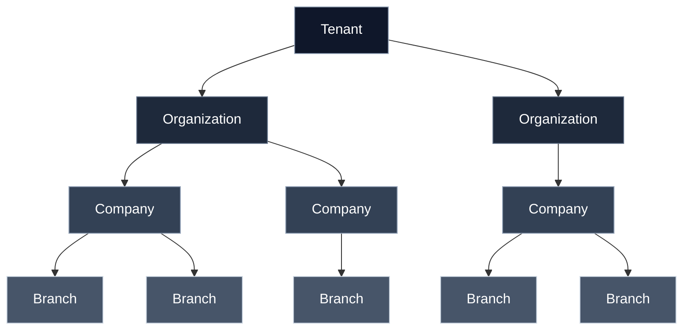

# Multi-Tenant Architecture

> **Aligned to ADR-017 — Dedicated Database per Tenant Architecture** (supersedes the shared-database posture of ADR-011 for Tenant business data). ADR-011 continues to apply to the Platform database's own single-schema deployment. See `docs/11-adrs/architecture/ADR-017-dedicated-database-per-tenant-architecture.md`.

> Part of **Pass 4B — Data Foundation (Data Constitution)**. Defines *what a tenant is* in BusinessOS, how data is scoped to tenants, how tenants are isolated (via a dedicated database per Tenant), and how tenant lifecycles are managed. Concrete provisioning tooling, connection routing code, RLS DDL, and infrastructure choices are out of scope.


## Overview

BusinessOS is a single-platform, multi-tenant ERP. Every business decision — from schema shape to caching to backup — is made under the assumption that many independent tenants share the same runtime and data layer, and that each tenant's data is invisible and inaccessible to every other tenant unless an explicit, audited cross-tenant contract exists.

**Specific frameworks, runtime versions, vendors, and implementation choices are intentionally deferred to ADRs and implementation documentation.**

## What is a Tenant

A **tenant** is the top-level unit of ownership, isolation, billing, and administration in BusinessOS. A tenant represents a single customer of the platform — typically a business, group, or enterprise — and owns all users, organisations, companies, branches, configuration, transactional data, and derived analytical data created under it.

Key properties of a tenant:

- **Uniquely identified** — every tenant carries a stable, immutable identifier that appears on every tenant-scoped record.
- **Independently governed** — administrators, roles, and policies inside one tenant have no reach into another tenant.
- **Billing anchor** — commercial contracts, subscriptions, quotas, and metering attach to the tenant.
- **Lifecycle anchor** — provisioning, suspension, export, and deletion operate at the tenant granularity.
- **Data-residency anchor** — a tenant is the smallest unit that can be pinned to a specific geographic region.

## Tenant / Workspace / Company / Branch Hierarchy

Under ADR-017 the hierarchy is **Platform → Tenant → [Dedicated Database + Logical Workspace] → Company → Branch / Financial Year**. Tenant owns exactly one dedicated database (the *persistence boundary*) and exactly one **logical Workspace** — a non-persistent container with no table, no identifier, and no independent configuration store. Workspace is a naming and navigation construct that organises everything a Tenant sees (Companies, Branches, Financial Years, Users, Roles, Permissions, Settings, AI Workspace, Modules).

See `docs/11-adrs/architecture/ADR-017-dedicated-database-per-tenant-architecture.md` (supersedes ADR-009, which itself superseded ADR-008).



```mermaid
flowchart TD
  T[Tenant]
  T --> O1[Organization]
  T --> O2[Organization]
  O1 --> C1[Company]
  O1 --> C2[Company]
  O2 --> C3[Company]
  C1 --> B1[Branch]
  C1 --> B2[Branch]
  C2 --> B3[Branch]
  C3 --> B4[Branch]
  C3 --> B5[Branch]

  classDef tenant fill:#0f172a,stroke:#94a3b8,color:#fff;
  classDef org fill:#1e293b,stroke:#64748b,color:#fff;
  classDef company fill:#334155,stroke:#94a3b8,color:#fff;
  classDef branch fill:#475569,stroke:#cbd5e1,color:#fff;
  class T tenant;
  class O1,O2 org;
  class C1,C2,C3 company;
  class B1,B2,B3,B4,B5 branch;
```

- **Tenant** — the isolation and commercial boundary. Everything below inherits its tenant identifier.
- **Organization** — an optional grouping layer for enterprises with multiple legal groups, holding structures, or brands under one tenant.
- **Company** — a legal entity. Accounting books, statutory filings, tax registrations, and fiscal years attach here.
- **Branch** — an operating location of a company. Inventory, sales, service, and payroll operations attach here.

A tenant with a single company and single branch is the common small-business shape; the hierarchy scales up without schema changes.


## Tenant-Scoped vs Globally Shared Data

Every entity in BusinessOS belongs to exactly one of these categories.

**Tenant-scoped data** — carries a mandatory tenant identifier; visible only within its tenant.
- All transactional data (vouchers, orders, ledgers, payroll runs, service tickets)
- All master data (customers, vendors, items, employees, warehouses)
- All configuration (charts of accounts, workflows, roles, permissions)
- All derived data (analytics rollups, notifications, documents)

**Globally shared data** — no tenant identifier; identical for every tenant.
- Reference data (countries, states, currencies, languages, units of measure, tax categories)
- Platform metadata (feature catalog, module registry, plan definitions)
- System catalogs (integration adapters, event type definitions)

Globally shared data is **read-only from a tenant's perspective**; only platform administrators can mutate it, and mutations follow a governed process (see Reference Data).

## Isolation Strategy

Under ADR-017, tenant isolation is a **physical database boundary**, not only a row-level filter. Layers exist so that a single failed layer cannot compromise the tenancy invariant.

1. **Identity layer** — every authenticated request carries a resolved Tenant claim; there is no anonymous access to Tenant data.
2. **Tenant-resolution layer** — the Platform database resolves the Tenant claim to a dedicated Tenant database connection via registry metadata. No handler proceeds without a Tenant-scoped connection.
3. **Persistence layer** — Tenant business data lives **only** inside that Tenant's dedicated database. Cross-tenant table joins are impossible by construction; there is no shared table to join.
4. **Application layer** — every domain service accepts Tenant scope as an explicit input and refuses ambiguous scope. No code path holds connections to two Tenant databases simultaneously for a business read/write.
5. **Cache layer** — cache keys embed the Tenant identifier; there is no shared-key path that could leak cross-tenant.
6. **Transport layer** — outbound integrations resolve Tenant-specific credentials; a Tenant cannot use another Tenant's integration credentials.

**Isolation model:** *dedicated database per Tenant*. The Platform database stores only platform metadata (tenant registry, platform users, licenses, subscriptions, platform audit, provisioning state, connection routing) and holds **no Tenant business data**.

## Row-Level Security Strategy (Defense-in-Depth)

Under ADR-017, the **primary** tenant boundary is the dedicated database. Row-level security (RLS) is a **defense-in-depth** mechanism, not the primary isolation mechanism.

- **Inside a Tenant database**, RLS may still scope data to Companies, Branches, Users, or roles as a within-Tenant defense-in-depth layer.
- **Inside the Platform database** (single-schema deployment), ADR-011's shared-schema/RLS posture continues to apply to platform metadata.
- **The Tenant claim is set once per request** in the resolved Tenant DB session/context by the trusted request pipeline; domain code cannot forge it.
- **Bypass is a privileged, audited action** — only platform-level roles used by controlled infrastructure operations may bypass RLS, and every bypass is logged.
- **Global reference data** (see Reference Data) is served either from the Platform database or from per-Tenant seed copies; either way it is read-only for Tenant sessions.
- Concrete RLS DDL, role names, and enforcement mechanics live in downstream ADRs and implementation documents.


## Cross-Tenant Operations

Cross-tenant access is a deliberate, narrow, and audited concept — not a convenience.

**Legitimate cross-tenant scenarios:**
- Platform administration and support (with explicit, time-bounded elevation and audit trail).
- Aggregated platform metrics computed over anonymised or pre-aggregated derivations.
- Marketplace or partner scenarios where two tenants have signed a mutual data-sharing contract; sharing occurs through explicit exported artifacts, not shared tables.
- Tenant migration and merge operations.

**Rules for cross-tenant operations:**
- Never through direct table joins.
- Always through explicit APIs or event exports with a documented contract.
- Always with an audit record naming actor, purpose, scope, and time window.
- Never as an implicit side effect of feature code.

## Tenant Lifecycle

Every tenant progresses through an explicit lifecycle. Each transition is event-generating, audited, and reversible where the business rules permit.

```text
requested → provisioning → active → suspended → deactivated → exported → archived → purged
```

- **Requested** — a tenant is proposed (self-serve signup, sales-led onboarding, migration import).
- **Provisioning** — infrastructure, default configuration, seed reference data, and initial administrator are prepared.
- **Active** — full read/write; billed; monitored.
- **Suspended** — read-only or gated access, typically for payment issues or policy holds; reversible.
- **Deactivated** — administrator-initiated deactivation; no user access; data retained for the contractual grace window.
- **Exported** — a full, portable export of the tenant's data is produced and delivered per contract.
- **Archived** — hot storage removed; data retained in cold form for the statutory retention window; restore possible with defined RTO.
- **Purged** — controlled, logged, non-reversible destruction after all retention obligations are met; only anonymised metadata survives for platform accounting.

## Data Residency

- **A tenant is pinned to a residency zone at provisioning time.**
- **All primary storage, backups, and analytical derivations for that tenant remain within its zone**, subject to documented exceptions (e.g. anti-abuse services).
- **Zone changes are migration events**, not runtime toggles.
- **Cross-zone platform operations** (billing, support tooling, aggregated metrics) either operate on anonymised derivations or are executed inside the tenant's zone.
- Concrete zone list, replication rules, and legal mappings live in commercial and compliance documentation.

## Tenancy Decisions Pending

| Topic | Why Deferred | Rough Window | Owner |
|---|---|---|---|
| Concrete RLS policy patterns and DDL | Coupled to database engine choice | Pass 4C / ADR | Platform |
| Dedicated-schema and dedicated-database tiers | Depends on enterprise contracts | Commercial pass | Product + Platform |
| Session/claim propagation mechanism | Coupled to auth architecture | Pass 4C / Security | Security |
| Tenant-migration tooling and cutover procedure | Depends on operational scale | Post-pilot | Platform |
| Cross-tenant marketplace contract shape | Depends on partner scenarios | Later pass | Product |
| Data-residency zone catalog | Depends on target markets | Commercial pass | Product |
| Grace-window durations per lifecycle stage | Commercial/legal decision | Commercial pass | Product + Legal |

## Conforms to Canon

- **Canon: Tenancy is a first-class invariant** — every non-global record is tenant-scoped and RLS-enforced.
- **Canon: No shared mutable global state per tenant** — globals are governed reference data; tenants cannot mutate them.
- **Canon: Auditability** — every cross-tenant or privileged bypass is logged with actor, purpose, and time.
- **Canon: Vendor Neutrality** — no database, IAM provider, or infrastructure vendor is named.
- **Canon: Deferred Decisions Are Named** — every open topic appears in *Tenancy Decisions Pending* with an ADR pointer.

## References

- Master Architecture — platform layers and boundaries.
- Domain-Driven Design — bounded contexts and cross-domain contracts.
- Domain Map — Foundation domain (Tenant, Organization, Company, Branch) and consumers.
- Database Architecture — data principles and lifecycle.
- Database Standards — tenant column conventions and audit fields.
- Data Dictionary — canonical Tenant/Organization/Company/Branch definitions.
- Reference Data — globally shared, tenant-read-only catalogs.
