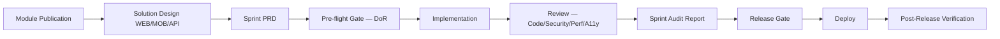

# Chapter 03 — Development Workflow

## Purpose

Describe the end-to-end path a unit of work follows from intent to production, referencing the authoritative documents at each step.

## Scope

Every sprint of every module in Business OS.

## Audience

Engineers · AI collaborators · Reviewers · Release managers.

## Responsibilities

- Sprint owner: verifies pre-flight gates before implementation.
- Reviewer: enforces DoD and evidence trail.
- Release manager: confirms Go-Live checklist.

## Workflow



## Stages

### 1. Intent

Every unit of work starts from an approved Module Publication (`docs/45-module-publications/`). The publication owns scope and cross-platform boundaries.

### 2. Design

Solution Design artifacts (`docs/46-solution-design/` or `docs/60-solution-design/`) translate the publication into WEB/MOB/API deliverables. The EEMP never re-derives these.

### 3. Planning

The Sprint PRD (`docs/30-sprint-prds/`) captures acceptance criteria, dependencies, and evidence. Sprint scope is immutable once approved.

### 4. Pre-flight Gate — Definition of Ready

Verify:

- Sprint PRD approved.
- Dependencies present or explicitly waived.
- RBAC permissions defined in `permission-catalog.manifest.yaml` when required.
- Migrations planned per DATABASE_STANDARD.
- Observability plan present per PLATFORM_OBSERVABILITY_STANDARD.

### 5. Implementation

Follow the coding standard (Chapter 04) and UI/UX standard (Chapter 05). Adhere to Backend, Database, and Security standards (Chapters 06–08).

### 6. Review

Code / Security / Performance / Accessibility reviews using the checklists referenced in Chapter 04 and Chapter 17.

### 7. Sprint Audit Report

Every sprint produces a report under `docs/50-audit-reports/SPRINT_<n>_<TOPIC>_REPORT.md` with verification matrix, evidence, and outstanding items.

### 8. Release Gate

Verify Go-Live Checklist (Chapter 19). Confirm rollback plan and observability signals.

### 9. Deploy

Deployment follows Chapter 16. No hotfix bypasses DoD.

### 10. Post-Release Verification

Runs land in `docs/62-post-release-verification/`. Any regression opens a follow-up sprint.

## Roles

| Role | Responsibility |
|------|----------------|
| Technical Lead | DoR/DoD enforcement, code review sign-off |
| Architecture Board | Deviations from standards or ADRs |
| Product Owner | Scope and acceptance |
| Security Review | Threat model and access control |
| QA Lead | Test strategy and coverage |

## Definition of Ready (DoR)

- Sprint PRD approved.
- Dependencies satisfied.
- Test strategy drafted (Chapter 15).
- Observability plan drafted.
- Rollback plan drafted.

## Definition of Done (DoD)

- All acceptance criteria met.
- Tests green (typecheck + unit + relevant integration).
- Evidence trail complete (audit report).
- No unresolved High severity findings (per FINDING_SEVERITY_STANDARD).
- Documentation cross-references updated.

## Dependencies

- FINDING_SEVERITY_STANDARD (`docs/15-governance/FINDING_SEVERITY_STANDARD.md`)
- PLATFORM_OBSERVABILITY_STANDARD (`docs/15-governance/PLATFORM_OBSERVABILITY_STANDARD.md`)
- PLATFORM_TESTING_STANDARD (`docs/15-governance/PLATFORM_TESTING_STANDARD.md`)
- ARCHITECTURE_REVIEW_GATE_STANDARD (`docs/15-governance/ARCHITECTURE_REVIEW_GATE_STANDARD.md`)

## Related Documents

- [02_Repository_Governance](02_Repository_Governance.md)
- [04_Coding_Standards](04_Coding_Standards.md)
- [11_Sprint_Execution](11_Sprint_Execution.md) *(Phase 3)*
- [16_DevOps_and_Release](16_DevOps_and_Release.md) *(Phase 4)*
- [19_Go_Live_Checklist](19_Go_Live_Checklist.md) *(Phase 4)*

## Cross References

- **Related Documents:** 02_Repository_Governance, 04_Coding_Standards
- **Referenced Standards:** FINDING_SEVERITY_STANDARD, PLATFORM_OBSERVABILITY_STANDARD, PLATFORM_TESTING_STANDARD, ARCHITECTURE_REVIEW_GATE_STANDARD, DATABASE_STANDARD
- **Referenced ADRs:** ADR Index (all engineering and platform ADRs)
- **Referenced Modules:** All
- **Referenced Sprint PRDs:** All (workflow applies universally)
- **Referenced Solution Designs:** All

## Open Questions

- None at initial draft.

## Approval Status

Draft — pending Architecture Board sign-off.

## Evidence

```
Source:             docs/15-governance/ARCHITECTURE_REVIEW_GATE_STANDARD.md
Authority:          Governance Standards
Reference:          Review gate criteria
Applicable Modules: All
Confidence:         High
```

```
Source:             docs/15-governance/PLATFORM_TESTING_STANDARD.md
Authority:          Governance Standards
Reference:          Testing gates and DoD
Applicable Modules: All
Confidence:         High
```

## Discovery Inventory

- Referenced files: ARCHITECTURE_REVIEW_GATE_STANDARD, PLATFORM_TESTING_STANDARD, PLATFORM_OBSERVABILITY_STANDARD, FINDING_SEVERITY_STANDARD, DATABASE_STANDARD, MODULE_IMPLEMENTATION_WORKFLOW (`docs/MODULE_IMPLEMENTATION_WORKFLOW.md`).
- Referenced standards: as above.
- Referenced ADRs: ADR Index.
- Referenced PRDs: All sprint PRDs (`docs/30-sprint-prds/`).
- Referenced Solution Designs: All.
- Referenced Module Publications: All.
- Referenced Sprint Plans: `docs/SPRINT_ROADMAP.md`.

## Revision History

| Version | Date | Author | Change |
|---------|------|--------|--------|
| 0.1.0 | 2026-07-23 | Project Architecture | Initial draft — 10-stage workflow, DoR/DoD baseline. |
