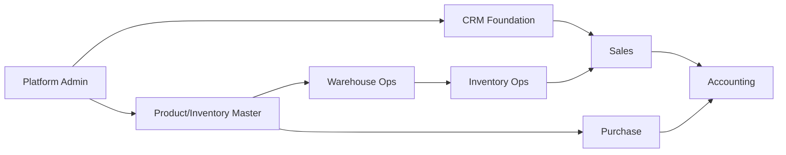

# Chapter 10 — Module Dependency Matrix

> Orchestration only. Dependency sources of truth are the existing matrices; this chapter aggregates references, not data (R-19, R-20).

## Purpose *(Normative)*

Point engineers at the authoritative module and sprint dependency matrices and describe how they are consumed for sequencing and impact analysis.

## Scope *(Normative)*

All inter-module dependencies across MOD-001…MOD-019, all cross-cutting engine usage, and the mapping between ADRs and impacted modules.

## Audience *(Informative)*

Roadmap owners · Module owners · Sprint leads · Reviewers · AI collaborators.

## Responsibilities *(Normative)*

- Roadmap owners keep the authoritative matrices current; the EEMP does not duplicate their content.
- Engineers consult the matrices before planning a sprint that touches shared engines or upstream modules.

## Inputs *(Informative)*

Verified during Repository Discovery:

- `docs/module-dependency-matrix.md`
- `docs/SPRINT_DEPENDENCY_MATRIX.md`
- `docs/ADR_IMPACT_MATRIX.md`
- `docs/ENGINE_USAGE_MATRIX.md`
- `docs/MODULE_CATALOG.md`
- `docs/MODULE_PUBLICATION_CATALOG.md`
- `docs/SPRINT_ROADMAP.md`
- `docs/11-adrs/architecture/ADR-007-core-erp-module-boundaries.md`
- `docs/05-adr/ADR-0011-capability-layer-roadmap.md`

## Outputs *(Informative)*

- Single pointer surface for dependency, sequencing, and impact questions.
- Traceability from each module to its upstream and downstream dependencies.

## Consumption Guidance *(Normative)*

| Question | Authoritative Source | How Engineers Consume |
|---|---|---|
| "Which modules block MOD-N?" | `docs/module-dependency-matrix.md` | Read the row for MOD-N; do not implement N before its upstream modules. |
| "Which sprints must precede sprint S?" | `docs/SPRINT_DEPENDENCY_MATRIX.md` | Order backlog per the matrix; escalate cycles to Architecture Board. |
| "Which modules are affected if ADR-X changes?" | `docs/ADR_IMPACT_MATRIX.md` | Refresh impact list before merging an ADR change. |
| "Which shared engine does this module consume?" | `docs/ENGINE_USAGE_MATRIX.md` | Confirm the engine exists at the required version before sprint start. |
| "What is the overall wave sequence?" | `docs/SPRINT_ROADMAP.md`, ADR-0011 | Follow capability-layer sequencing. |
| "Is Warehouse before Inventory?" | ADR-007 | Yes — enforce during sprint sequencing. |

## Reference Diagram *(Informative)*

The authoritative dependency graph lives in `docs/module-dependency-matrix.md`. The reference view below is illustrative only; when the two disagree, the source of truth wins. Mermaid diagram type: `flowchart` (chosen for readability of a directed graph; `gitGraph` is permitted for waves where staged flow is clearer).



## Dependencies *(Informative)*

- Chapters 02, 09.

## Related Documents *(Informative)*

- [09_Module_Development_Framework](09_Module_Development_Framework.md)

## Cross References *(Informative)*

- **Referenced Standards:** REPOSITORY_NAVIGATION_STANDARD
- **Referenced ADRs:** ADR-007, ADR-0011
- **Referenced Modules:** MOD-001 … MOD-019
- **Referenced Sprint PRDs:** All (via SPRINT_ROADMAP)
- **Referenced Solution Designs:** All WEB/MOB/API-###

## Open Questions

- None at initial draft.

## Approval Status

Draft — pending Architecture Board sign-off.

## Evidence

```
Source:             docs/module-dependency-matrix.md, docs/SPRINT_DEPENDENCY_MATRIX.md, docs/ADR_IMPACT_MATRIX.md, docs/ENGINE_USAGE_MATRIX.md
Authority:          Root matrices
Reference:          Dependency and impact data
Applicable Modules: All
Confidence:         High
```

```
Source:             docs/11-adrs/architecture/ADR-007-core-erp-module-boundaries.md, docs/05-adr/ADR-0011-capability-layer-roadmap.md
Authority:          ADR
Reference:          Core ERP boundaries and capability-layer sequencing
Applicable Modules: All
Confidence:         High
```

## Discovery Inventory

- Discovery order followed as listed in R-18.
- No duplicates detected among the cited matrices (each covers a distinct axis).
- Reference diagram is illustrative; authoritative content lives in `docs/module-dependency-matrix.md`.

## Traceability Matrix

| Chapter | Referenced Standards | Referenced ADRs | Referenced PRDs | Referenced Solution Designs | Applicable Modules | Applicable Sprints |
|---|---|---|---|---|---|---|
| 10 Dependencies | REPOSITORY_NAVIGATION | ADR-007, ADR-0011 | All | All WEB/MOB/API-### | MOD-001 … MOD-019 | All |

## Revision History

| Version | Date | Author | Change |
|---------|------|--------|--------|
| 0.1.0 | 2026-07-23 | Project Architecture | Initial draft — orchestration surface for module dependencies. |
