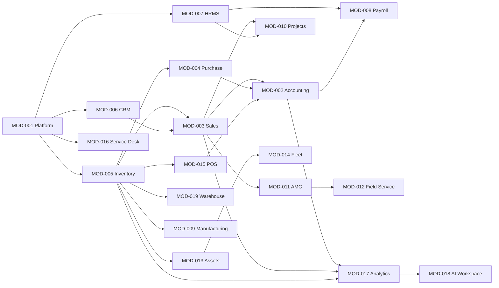

# 04 — Dependency Architecture

## Purpose
Consolidate the module and shared-service dependency graph used to sequence implementation. Derived from ADR-007, Module PRDs, and Module Publications.

## Shared Platform Services (MOD-001)
All business modules depend on: Authentication, Organizations, Workspace, RBAC, Audit, Notifications, Settings, Search, Documents, Workflow, Reporting.

## Module Dependency Graph

## Critical Path
`MOD-001 → MOD-005 → MOD-003 → MOD-002 → MOD-017 → MOD-018`

Any slip on the critical path defers all downstream waves.

## External Integration Dependencies
Follow module-specific SD (API) chapters: payment providers (MOD-015), tax authorities (MOD-002), telematics (MOD-014), messaging (MOD-016), AI Gateway (MOD-018).

## References
- ADR-007 `docs/11-adrs/architecture/ADR-007-core-erp-module-boundaries.md`
- EEMP Ch. 10 Module Dependency Matrix
- `docs/module-dependency-matrix.md`
- Module PRDs (all 19)
