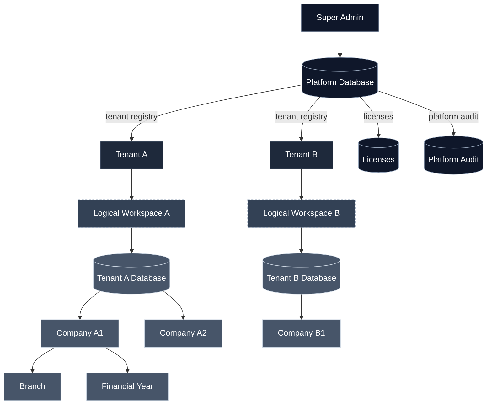

# MOD001_PLATFORM_BASELINE_v2 — Platform Administration Module Baseline

> **Supersedes `MOD001_PLATFORM_BASELINE_v1`.** This baseline republishes MOD-001 Platform Administration under **ADR-017 — Dedicated Database per Tenant Architecture**. It replaces all shared-database assumptions inherited from v1 with a dedicated-database-per-Tenant posture and reintroduces **Workspace** as a **logical (non-persistent) container**. This baseline is a reference consolidation; it introduces no new engines and no new ADRs beyond ADR-017. Downstream modules that consumed v1 continue to depend on the same Platform capabilities — capability names are stable; the persistence model beneath them has changed.

## 1. Purpose

`MOD001_PLATFORM_BASELINE_v2` is the refreshed Stage 3 artifact for **MOD-001 Platform Administration** under the architecture ratified by **ADR-017**. It certifies:

- Every Sprint PRD reserved in [`MOD-001_SPRINT_PLAN_v2`](../30-sprint-prds/platform/MOD-001_SPRINT_PLAN_v2.md) (`SPR-MOD-001-001` … `SPR-MOD-001-010`) is enumerated and authoring-ready.
- Every Module Completion Criterion in v1 is preserved and extended to cover the new capability areas introduced by ADR-017 (Database Provisioning, Licensing, Platform Operations, Platform Administration Console).
- No inherited capability from v1 is dropped; every v1 capability is either preserved verbatim or restated under the new architecture.
- No shared-database assumption remains.

The module is republished for downstream consumption by MOD-002 through MOD-018.

## 2. Module Scope

Platform Administration under ADR-017 owns:

- **Tenant lifecycle** — provisioning, activation, suspension, deactivation, export, archival, purge.
- **Dedicated database lifecycle** — provisioning, schema bootstrap, versioning, backup, restore, retirement of the per-Tenant database that backs each Tenant.
- **Logical Workspace** — the non-persistent business container derived from Tenant context; navigation, presentation, and configuration inheritance only.
- **Organization structure** — Companies, Branches, Financial Years within a Tenant database.
- **Users, roles, permissions** — inside a Tenant database, plus Platform users and Super Admin roles inside the Platform database.
- **Configuration hierarchy** — Platform → Tenant → Company → Branch → User; effective configuration resolution.
- **Localization** — locale, currency, timezone, fiscal calendar, regional formats.
- **Licensing** — attached to Tenant; stored in Platform database; enforced before Tenant DB connection.
- **Platform operations** — monitoring, provisioning, backup, restore, upgrade, maintenance, health.
- **Audit** — Platform audit (Platform DB) and Tenant audit (Tenant DB), with a Platform administration surface for review and export.
- **Notifications, search, documents, workflow, reporting** — Platform-owned frameworks consumed by every module.
- **Platform Administration Console** — Super Admin surface for Tenant management, licensing, monitoring, operations.

Governance conventions established in v1 (Event Ownership, Effective Configuration, Configuration Ownership, Localization Ownership, Audit Ownership) are preserved verbatim.

## 3. Architecture Under ADR-017

Workspace is drawn dashed to signal that it has no persistence. Every solid line to a Tenant database is a runtime connection routed through the Platform registry.

## 4. Capability Coverage

Every Module PRD capability traces to at least one Sprint PRD in Sprint Plan v2.0.

| Capability Area | Sprint(s) |
| --- | --- |
| Tenant provisioning and lifecycle | SPR-MOD-001-001 |
| Dedicated database provisioning and lifecycle | SPR-MOD-001-001, SPR-MOD-001-008 |
| Workspace bootstrap (logical) & organisation structure | SPR-MOD-001-001, SPR-MOD-001-002 |
| Company, Branch, Financial Year | SPR-MOD-001-002 |
| Users, roles, permissions, membership | SPR-MOD-001-003 |
| Tenant configuration & feature flags & inheritance | SPR-MOD-001-004 |
| Licensing, subscriptions, plan limits, renewal, suspension | SPR-MOD-001-005 |
| Localization (timezone, currency, fiscal, language, formats) | SPR-MOD-001-006 |
| Workspace services (branding, dashboard, navigation, notifications, integrations — logical) | SPR-MOD-001-007 |
| Platform operations (monitoring, provisioning, DB lifecycle, backup, maintenance, health) | SPR-MOD-001-008 |
| Audit & compliance (Platform + Tenant audit, security, compliance) | SPR-MOD-001-009 |
| Platform Administration Console (Super Admin surface) | SPR-MOD-001-010 |

## 5. ERP Core Engine Consumption

| Engine | Consumed By |
| --- | --- |
| ENG-001 Identity Engine | 001, 002, 003, 004, 005, 006, 007, 008, 009, 010 |
| ENG-002 Authorization Engine | 001, 002, 003, 004, 005, 006, 007, 008, 009, 010 |
| ENG-003 Permission Management Engine | 003, 010 |
| ENG-004 Audit Engine | 001, 002, 003, 004, 005, 006, 007, 008, 009, 010 |
| ENG-005 Configuration Engine | 004, 006, 007 |
| ENG-006 Localization Engine | 006, 007 |
| ENG-017 Numbering Engine | 002 |
| ENG-020 Search Engine | 009, 010 |
| ENG-021 Reporting Engine | 009, 010 |
| ENG-024 Event Engine | 001, 002, 003, 004, 005, 006, 007, 008, 009, 010 |
| ENG-025 Notification Engine | 007, 008, 009 |
| ENG-027 Export Engine | 009, 010 |

No engine behavior is redefined. All consumption is authoritative for MOD-001 under v2.

## 6. ADR Consumption

| ADR | Status | Consumed By |
| --- | --- | --- |
| ADR-017 Dedicated Database per Tenant Architecture | Accepted | 001–010 |
| ADR-011 Multi-Tenant Isolation | Accepted (Platform DB scope) | 001, 008, 009 |
| ADR-014 Audit Strategy | Accepted | 001–010 |
| ADR-030 Authentication Model | Proposed | 001, 003, 010 |
| ADR-032 RBAC + ABAC | Accepted | 003, 010 |
| ADR-025 Feature Flags | Proposed | 004, 007 |
| ADR-026 Configuration Hierarchy | Proposed | 004, 006, 007 |
| ADR-035 Data Classification | Proposed | 009 |
| ADR-036 Audit Integrity | Proposed | 009 |
| ADR-051 Transactional Outbox | Proposed | 001–010 |
| ADR-065 Disaster Recovery | Proposed | 008 |

ADRs at `Proposed` status must be `Accepted` before their consuming sprint enters Stage 2.

## 7. Governance Conventions Established / Preserved

Preserved from v1:

- **Event Ownership Convention** — unchanged.
- **Effective Configuration Convention** — unchanged; resolves through Platform → Tenant → Company → Branch → User.
- **Configuration Ownership Convention** — unchanged.
- **Localization Ownership Convention** — unchanged.
- **Audit Ownership Convention** — extended: Platform owns both Platform audit (Platform DB) and the review surface over Tenant audit (Tenant DBs). Business modules still MUST NOT implement independent audit mechanisms.

New under v2:

- **Tenant Persistence Boundary Convention** — every Tenant business record is stored in that Tenant's dedicated database; no cross-tenant table joins are permitted; cross-tenant Platform metrics operate on anonymised or pre-aggregated derivations delivered to the Platform layer.
- **Workspace is Non-Persistent Convention** — Workspace has no table, no independent identifier, no independent configuration store. Any future promotion requires an ADR that satisfies ADR-017 §Promotion Criteria.
- **License Attachment Convention** — licenses attach to Tenant; never to Company, Branch, or Workspace; enforcement precedes any Tenant DB connection.

## 8. Module Completion & Freeze Statement

MOD-001 Platform Administration is republished under ADR-017 for downstream consumption at the moment SPR-MOD-001-001 … SPR-MOD-001-010 Sprint PRDs are authored and delivered per **Sprint Plan v2.0**.

> **Freeze.** Downstream modules (MOD-002 … MOD-018) MUST consume this baseline, not v1. Capability names are stable across the version boundary; the persistence model beneath them is dedicated-database-per-Tenant.

## 9. Deferred Items

Preserved from v1 (still deferred):

- SSO / MFA / password policy enforcement — future Authentication module or ADR.
- Identity federation (SAML / OIDC) — external integration surface.
- SIEM integration — infrastructure layer.
- Business intelligence workspaces — owned by MOD-017 Analytics.

Added under v2 (deferred to downstream ADRs and sprint PRDs):

- Vendor / cloud region / database engine version for tenant databases.
- Replication topology and disaster-recovery topology per residency zone.
- Cross-zone platform operations pattern (anonymised derivations).
- Enterprise dedicated-schema and dedicated-cluster deployment variants.

## 10. Downstream Dependencies

- MOD-002 Accounting … MOD-018 AI Workspace consume this baseline. Every business record produced by these modules lives inside the Tenant database owned by MOD-001 under ADR-017.

## 11. References

- [`docs/11-adrs/architecture/ADR-017-dedicated-database-per-tenant-architecture.md`](../11-adrs/architecture/ADR-017-dedicated-database-per-tenant-architecture.md)
- [`docs/11-adrs/architecture/ADR-009-workspace-retirement.md`](../11-adrs/architecture/ADR-009-workspace-retirement.md) *(superseded by ADR-017)*
- [`docs/11-adrs/architecture/ADR-008-platform-tenant-workspace-hierarchy.md`](../11-adrs/architecture/ADR-008-platform-tenant-workspace-hierarchy.md)
- [`docs/11-adrs/data/ADR-011-multi-tenant-isolation.md`](../11-adrs/data/ADR-011-multi-tenant-isolation.md)
- [`docs/20-module-prds/platform/MODULE_PRD.md`](../20-module-prds/platform/MODULE_PRD.md)
- [`docs/30-sprint-prds/platform/MOD-001_SPRINT_PLAN_v2.md`](../30-sprint-prds/platform/MOD-001_SPRINT_PLAN_v2.md)
- [`docs/40-module-baselines/MOD001_PLATFORM_BASELINE_v1.md`](./MOD001_PLATFORM_BASELINE_v1.md) *(superseded)*
- [`docs/MODULE_BASELINE_CATALOG.md`](../MODULE_BASELINE_CATALOG.md)
- [`docs/02-architecture/multi-tenant-architecture.md`](../02-architecture/multi-tenant-architecture.md)
- [`docs/15-governance/TENANCY_STANDARD.md`](../15-governance/TENANCY_STANDARD.md)
- [`docs/50-audit-reports/MOD001_V2_ARCHITECTURE_REFRESH_REPORT.md`](../50-audit-reports/MOD001_V2_ARCHITECTURE_REFRESH_REPORT.md)
