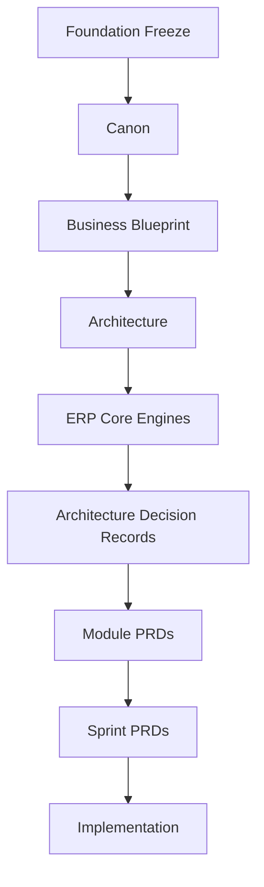

# Document Traceability

> **Derived document.** This guide is a projection of authoritative sources (Foundation Freeze, Canon, Business Blueprint, Architecture, ERP Core Engines, ADRs). On any conflict, the source file wins and this guide is corrected in the same change.

## Purpose

The **Document Traceability** guide describes how every documentation family in BusinessOS depends on the ones above it, which document is authoritative in each layer, and how a change in an upstream document propagates downstream. It is the reader's map for navigating the repository, and the maintainer's checklist for keeping derived indexes in sync with their sources.

## Documentation Hierarchy

| Layer | Family | Location |
| --- | --- | --- |
| 0 | Foundation Freeze | `docs/FOUNDATION_FREEZE_v1.md` |
| 1 | Canon | `docs/canon.md` |
| 2 | Business Blueprint | `docs/00-vision/`, `docs/01-master/` |
| 3 | Architecture | `docs/02-architecture/` |
| 4 | Design Standards | `docs/03-design/` |
| 5 | ERP Core Engines | `docs/10-erp-core/` |
| 6 | Architecture Decision Records | `docs/11-adrs/` |
| 7 | Module PRDs | `docs/20-module-prds/` (`MOD-001` … `MOD-018`) |
| 8 | Sprint PRDs | `docs/30-sprint-prds/` (`SPR-MOD-NNN-NNN`) — scaffolded in Pass 8, authored per methodology in `docs/SPRINT_AUTHORING_GUIDE.md`, sequenced by `docs/SPRINT_ROADMAP.md` and `docs/SPRINT_DEPENDENCY_MATRIX.md`, sized against `docs/SPRINT_ESTIMATION_GUIDE.md`, and produced iteratively in Pass 8.x under the three-stage cadence defined in `docs/MODULE_IMPLEMENTATION_WORKFLOW.md` (Stage 1 planning → Stage 2 authoring → Stage 3 baseline) |
| — | Reference Documents | `docs/06-integrations/`, `docs/07-reports/`, `docs/08-business-rules/`, `docs/09-ai/`, `docs/11-erd/`, `docs/12-ui-components/`, `docs/13-workflows/`, `docs/14-localization/`, `docs/99-templates/` |
| — | Cross-cutting derived indexes | `docs/` root (Repository Map, Document Index, Document Traceability, Ownership Matrix, Glossary Index, Engine Usage Matrix, ADR Impact Matrix, Module Catalog, Sprint Catalog, Sprint Dependency Matrix) |

## Reading Order

1. `docs/FOUNDATION_FREEZE_v1.md`
2. `docs/canon.md`
3. `docs/00-vision/vision.md`, `docs/01-master/prd.md`
4. `docs/02-architecture/README.md` and its children
5. `docs/10-erp-core/README.md`, `docs/10-erp-core/ENGINE_CATALOG.md`
6. `docs/11-adrs/README.md`, `docs/11-adrs/ADR_INDEX.md`
7. Module PRDs (Pass 7+)
8. Sprint PRDs (Pass 8+)

## Document Dependency Chain

Dependency direction is one-way. A document at layer N may reference layers 0..N-1. It MUST NOT redefine, override, or contradict them.

## Authoritative Document Rules

- **Authoritative** documents are the single source of truth for their subject. Examples: `canon.md`, `docs/02-architecture/master-architecture.md`, each ERP Core Engine specification, each ADR file.
- **Derived** documents are projections of authoritative sources. Examples: `docs/10-erp-core/ENGINE_CATALOG.md`, `docs/11-adrs/ADR_INDEX.md`, and every guide under `docs/` root introduced by Pass 6.5.
- On any conflict, the authoritative document wins and the derived document is corrected in the same change.
- Derived documents MUST NOT become independent sources of truth. They exist to make the authoritative content discoverable.

## Change Propagation Rules

When an authoritative document changes, the maintainer MUST update every downstream document impacted by the change, in the same change set:

| Change in… | Review / regenerate |
| --- | --- |
| Foundation Freeze | Canon, Architecture, ERP Core, ADRs — impact analysis mandatory |
| Canon | Architecture, ADRs, Module PRDs |
| Business Blueprint | Architecture (only via ADR), Module PRDs |
| Architecture | ERP Core Engines (affected engines), ADRs referencing the section |
| ERP Core Engine spec | `ENGINE_CATALOG.md`, `ENGINE_USAGE_MATRIX.md`, ADRs referencing the engine, Module PRDs consuming it |
| ADR | `ADR_INDEX.md`, `ADR_IMPACT_MATRIX.md`, documents listed in the ADR's `affected_documents` |
| Module PRD | `MODULE_CATALOG.md`, dependent Sprint PRDs, module Stage 1 sprint plan (`MOD-<NNN>_SPRINT_PLAN.md`) |
| Module Sprint Plan (Stage 1) | Module folder README (`docs/30-sprint-prds/<module>/README.md`), Stage 2 Sprint PRDs authored under the plan |
| Any authoritative document | `DOCUMENT_INDEX.md`, `REPOSITORY_MAP.md`, `GLOSSARY_INDEX.md` if terms changed |

Derived documents SHOULD be regenerated or reviewed whenever an authoritative document is added, removed, renamed, or materially changed. They MUST NOT become independent sources of truth.

## Traceability Examples

- **Adding an engine capability** — Author or bump the engine spec under `docs/10-erp-core/`. Update `ENGINE_CATALOG.md` (version, dependencies), `ENGINE_USAGE_MATRIX.md` (consumers, if changed), and any ADR whose `affected_documents` list the engine. If the change is architectural, first raise an ADR in `docs/11-adrs/`; only after Accepted status does the engine spec change.
- **Superseding an ADR** — Create the replacement ADR in the same category range, set the old ADR's status to `Superseded` with `superseded_by`, and update both rows in `ADR_INDEX.md` and `ADR_IMPACT_MATRIX.md` in the same change.
- **Introducing a new Module PRD (Pass 7+)** — Copy `docs/99-templates/module-prd-template.md`, reference the engines it consumes by `ENG-NNN`, reference every ADR it depends on, and add a row to `MODULE_CATALOG.md`. The PRD MUST NOT redefine any engine, ADR, or architectural pattern.

## References

- `docs/FOUNDATION_FREEZE_v1.md`
- `docs/canon.md`
- `docs/02-architecture/README.md`
- `docs/10-erp-core/README.md`
- `docs/10-erp-core/ENGINE_CATALOG.md`
- `docs/11-adrs/README.md`
- `docs/11-adrs/ADR_INDEX.md`
- `docs/REPOSITORY_MAP.md`
- `docs/DOCUMENT_INDEX.md`
- `docs/DOCUMENT_OWNERSHIP_MATRIX.md`
